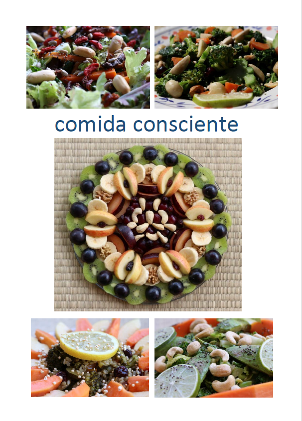

## **Comida Consciente**

_Comida Consciente_ es mi contribución para ayudar al mundo a comer más saludable. Es un libro electrónico gratuito.

**¿Como puedo obtenerlo?**

[Haz cliq aquí para bajar y abrir Comida Consciente en formato PDF](https://bjornkennethholmstrom.wordpress.com/wp-content/uploads/2018/06/comida-consciente1.pdf "Comida Consciente")

 

**¿Qué tipo de comida es?**

La comida se basa en una dieta basada en plantas (vegana). Es principalmente frutas, legumbres, nueces, semillas y verduras, y se convierte en comidas rápidas, fáciles, asequibles, apetitosas, atractivas y nutricionalmente equilibradas.

También publico fotos de alimentos y recetas como blogs en [esta página web mismo](https://bjornkennethholmstrom.wordpress.com) en la categoría 'food'.

**¿Es el libro disponible en otros idiomas?**

Si, [en esta página hay el original en Inglés.](https://bjornkennethholmstrom.wordpress.com/food) Otras traducciones están en camino.

**¿Quieres mas**?

Hay mas recetas y inspiración por comida en [este blog de comida anterior](https://beyondhealthyfood.wixsite.com/beyond-healthy-food) y en [esta cuenta de Instagram](https://www.instagram.com/beyond_healthy_food) donde publico ocasionalmente.
