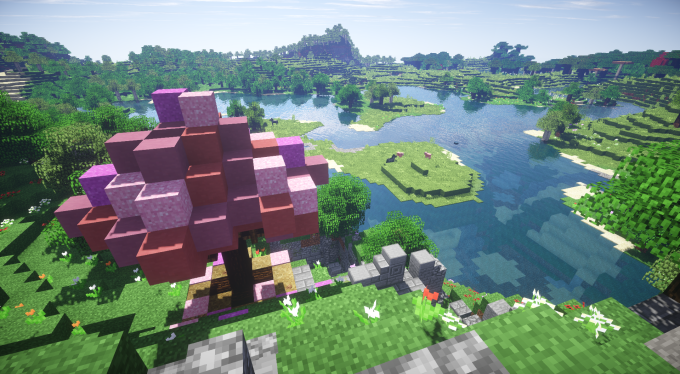

### What is b³O / Flower valley?

b³O is a [Minecraft Survival World](https://minecraft.gamepedia.com/Survival) which was created in November 2017. Its first public appearance was under the name Flower Valley in February 2018 in [this thread](https://www.minecraftforum.net/forums/minecraft-java-edition/survival-mode/2890897-survival-world-b3o-build-journal-and-download) on the Minecraft survival forums, which describes it in much detail. Later the world needed a name of its own, since Flower Valley was just the area to be built and populated.

### **Status**

b³O is updated to 1.13.

### [Link to download page](https://bjornkennethholmstrom.wordpress.com/b%c2%b3o-world-download/)

##### **What stuff do I need to build and explore b³O?**

- A computer with Windows, Linux or Mac OS, preferably with a keyboard, a mouse and a headset, headphones or speakers.

- A copy of [Minecraft Java Edition](http://www.minecraft.net) installed and running. When you launch the game, you can choose which version to run.  Choose 1.12.2 if you are running the world download.

##### **I downloaded** b³O**, now what do I do?**

Start Minecraft, then click on 'Options', followed by 'Resource Packs' and 'Open Resource Pack Folder'. This should open the folder 'resourcepacks' just below '.minecraft' in the local file browser on your system. Replace resourcepacks with saves and you are in the right folder. Place the world download there.

On Linux, it is usually in ~/.minecraft/saves

On Windows 7 it is usually C:/Users/\*your user name\*/AppData/Roaming/.minecraft/saves

On Windows 10 and Mac, I have no idea!

###### **I am in** b³O **but lost! How do I find Flower Valley?**

[**Read this page! It will help you find your bearings**](http://bjornkennethholmstrom.wordpress.com/flower-valley-get-started/)

##### I am not sure I want to play Minecraft, but I want to see what b³O is about.

You can experience the beginning of b³O without installing the game by reading the build journal. It is hosted in a dedicated thread on the Minecraft forums (here is the link: [https://www.minecraftforum.net/forums/minecraft-java-edition/survival-mode/2890897-survival-world-b3o-build-journal-and-download](https://www.minecraftforum.net/forums/minecraft-java-edition/survival-mode/2890897-survival-world-b3o-build-journal-and-download)) but for convenience I might migrate it to a website.

You can also watch the Let's Build-series for the Acacian Ascendancy:

https://www.youtube.com/playlist?list=PL1t2I7nTi4pTg2zxqB2XYx\_CAjdhG0uAw

##### I enjoy the game but I don't know how or what to build

[**This page has a bunch of additional useful resources**](http://bjornkennethholmstrom.wordpress.com/minecraft-resources) (build ideas, software for enhancing in-game graphics and performance, online build-tools and resource packs)

* * *

##### Can I use b³O for my own SMP (survival multi player) on a private server or on Minecraft Realms?

Sure!

##### Places this world is featured

[Thread on the Minecraft forums](https://www.minecraftforum.net/forums/minecraft-java-edition/survival-mode/2890897-survival-world-b3o-build-journal-and-download)

[Planet Minecraft page](https://www.planetminecraft.com/project/flower-valley-4136178/)
