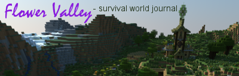

****

I recommend reading the journal from the beginning, but if you want to get an overview, or are looking for something specific, here is a chronological index to help you out. Click the titles in the list to read the entry:

- \[Build\] [Reception, sandstone hut, nether portal and farmland](https://www.minecraftforum.net/forums/minecraft-java-edition/survival-mode/2890897-survival-journal-flower-valley?comment=2)
- \[Build\] [Wizard's house and fishing shack](https://www.minecraftforum.net/forums/minecraft-java-edition/survival-mode/2890897-survival-journal-flower-valley?comment=4)
- \[Build\] [Forester's cabin](https://www.minecraftforum.net/forums/minecraft-java-edition/survival-mode/2890897-survival-journal-flower-valley?comment=7)
- \[Build\] [Smithy and stone mason + map](https://www.minecraftforum.net/forums/minecraft-java-edition/survival-mode/2890897-survival-journal-flower-valley?comment=9)
- \[Build\] [Potter, glass/sand-worker and dyer](https://www.minecraftforum.net/forums/minecraft-java-edition/survival-mode/2890897-survival-journal-flower-valley?comment=11)
- \[Build\] [General store and crafting workshop](https://www.minecraftforum.net/forums/minecraft-java-edition/survival-mode/2890897-survival-journal-flower-valley?comment=12)
- \[Build\] [The animalist's hut](https://www.minecraftforum.net/forums/minecraft-java-edition/survival-mode/2890897-survival-journal-flower-valley?comment=15)
- \[Build\] [Hobbit-inspired dwelling for landscaper, herbalist, grower and harvester](https://www.minecraftforum.net/forums/minecraft-java-edition/survival-mode/2890897-survival-journal-flower-valley?comment=18)
- \[Travel\] [Journey to Mushrooms](https://www.minecraftforum.net/forums/minecraft-java-edition/survival-mode/2890897-survival-journal-flower-valley?comment=23)
- \[Build\] [Snow and ice temple & storage](https://www.minecraftforum.net/forums/minecraft-java-edition/survival-mode/2890897-survival-journal-flower-valley?comment=25)
- \[Travel\] [A three-part mixed session](https://www.minecraftforum.net/forums/minecraft-java-edition/survival-mode/2890897-survival-journal-flower-valley?comment=26)
- \[Build\] [Red-stone controlled nether portal with hidden door to treasure vault](https://www.minecraftforum.net/forums/minecraft-java-edition/survival-mode/2890897-survival-journal-flower-valley?comment=33)
- \[Mixed\] [From wheat to wither, part I](https://www.minecraftforum.net/forums/minecraft-java-edition/survival-mode/2890897-survival-journal-flower-valley?comment=34)
- \[Build\] [Adaptive pathing and bridge building](https://www.minecraftforum.net/forums/minecraft-java-edition/survival-mode/2890897-survival-journal-flower-valley?comment=35)
- \[Mixed\] [From wheat to wither, part II](https://www.minecraftforum.net/forums/minecraft-java-edition/survival-mode/2890897-survival-journal-flower-valley?comment=37)
- \[Travel\] [Two journeys and a beacon](https://www.minecraftforum.net/forums/minecraft-java-edition/survival-mode/2890897-survival-journal-flower-valley?comment=41)
- \[Build\] [The Life Tree](https://www.minecraftforum.net/forums/minecraft-java-edition/survival-mode/2890897-survival-journal-flower-valley?comment=49)
- \[Build\] [Palm Tree and Ruin Brewin'](https://www.minecraftforum.net/forums/minecraft-java-edition/survival-mode/2890897-survival-journal-flower-valley?comment=51)
- \[Build\] [Chicken Sanctuary](https://www.minecraftforum.net/forums/minecraft-java-edition/survival-mode/2890897-survival-journal-flower-valley?comment=52)
- \[Build\] [Trees, lights, a lion and Minecraft botany](https://www.minecraftforum.net/forums/minecraft-java-edition/survival-mode/2890897-survival-journal-flower-valley?comment=53)
- \[Mixed\] [Mangrove groove](https://www.minecraftforum.net/forums/minecraft-java-edition/survival-mode/2890897-survival-journal-flower-valley?comment=54)
- \[Build\] The Adventurer's Hub
    1. [Entrances and ground floor walkway](https://www.minecraftforum.net/forums/minecraft-java-edition/survival-mode/2890897-survival-journal-flower-valley?comment=63)
    2. [Sacrificial fountain](https://www.minecraftforum.net/forums/minecraft-java-edition/survival-mode/2890897-survival-journal-flower-valley?comment=64)
    3. [The arena](https://www.minecraftforum.net/forums/minecraft-java-edition/survival-mode/2890897-survival-journal-flower-valley?comment=67)
    4. [The dragon](https://www.minecraftforum.net/forums/minecraft-java-edition/survival-mode/2890897-survival-journal-flower-valley?comment=70)
    5. [Poet's corner](https://www.minecraftforum.net/forums/minecraft-java-edition/survival-mode/2890897-survival-journal-flower-valley?comment=71)
    6. [Mob disco](https://www.minecraftforum.net/forums/minecraft-java-edition/survival-mode/2890897-survival-journal-flower-valley?comment=72)
    7. [Day & night hallway](https://www.minecraftforum.net/forums/minecraft-java-edition/survival-mode/2890897-survival-journal-flower-valley?comment=73)
    8. [The library](https://www.minecraftforum.net/forums/minecraft-java-edition/survival-mode/2890897-survival-journal-flower-valley?comment=76)
    9. [Philosopher's cave](https://www.minecraftforum.net/forums/minecraft-java-edition/survival-mode/2890897-survival-journal-flower-valley?comment=77)
    10. [Balcony](https://www.minecraftforum.net/forums/minecraft-java-edition/survival-mode/2890897-survival-journal-flower-valley?comment=83)
    11. [Staircase and cherry tree](https://www.minecraftforum.net/forums/minecraft-java-edition/survival-mode/2890897-survival-journal-flower-valley?comment=84)
- \[Build\] [Giant Owl](https://www.minecraftforum.net/forums/minecraft-java-edition/survival-mode/2890897-survival-journal-flower-valley?comment=74)
- \[Build\] [Custom trees](https://www.minecraftforum.net/forums/minecraft-java-edition/survival-mode/2890897-survival-journal-flower-valley?comment=80)
- \[Build\] [Life Tree Music Crystals, Part I](https://www.minecraftforum.net/forums/minecraft-java-edition/survival-mode/2890897-survival-journal-flower-valley?comment=89)
- \[Build\] [Life Tree Music Crystals, Part II](https://www.minecraftforum.net/forums/minecraft-java-edition/survival-mode/2890897-survival-journal-flower-valley?comment=90)
- \[Build\] [Minecart tracks, part I: Preparations and lower tunnel](https://www.minecraftforum.net/forums/minecraft-java-edition/survival-mode/2890897-survival-journal-flower-valley?comment=91)
- \[Travel\] [Mesa excursion](https://www.minecraftforum.net/forums/minecraft-java-edition/survival-mode/2890897-survival-journal-flower-valley?comment=92)
- \[Build\] [Minecart tracks, part II: Slope](https://www.minecraftforum.net/forums/minecraft-java-edition/survival-mode/2890897-survival-journal-flower-valley?comment=93)
- \[Build\] [Minecart tracks, part III: Flower Valley Station](https://www.minecraftforum.net/forums/minecraft-java-edition/survival-mode/2890897-survival-journal-flower-valley?comment=94)
- \[Build\] [Minecart tracks, part IV: Extreme Hills Mining Station](https://www.minecraftforum.net/forums/minecraft-java-edition/survival-mode/2890897-survival-journal-flower-valley?comment=95)
- \[Travel\] [The End, part I: Preparations and battle](https://www.minecraftforum.net/forums/minecraft-java-edition/survival-mode/2890897-survival-journal-flower-valley?comment=98)
- \[Travel\] [The End, part II: Exploration and aftermath](https://www.minecraftforum.net/forums/minecraft-java-edition/survival-mode/2890897-survival-journal-flower-valley?comment=103)
