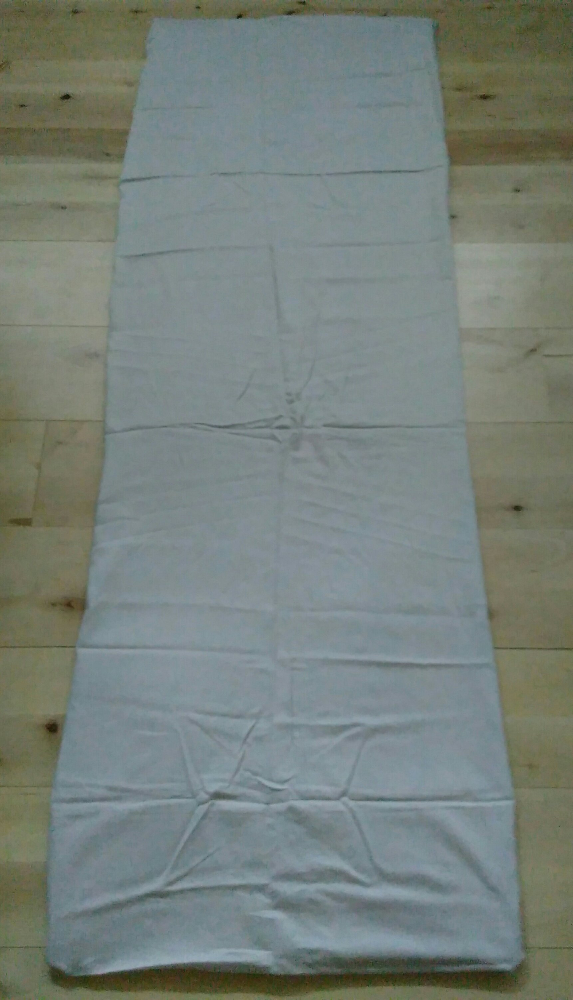

> "Yoga; translate to English yoke, from the root yuj, to attach, specifically the human spirit with the divine."

> Asana: from Sanskrit āsana ‘seat, manner of sitting

I have practiced [yoga](https://en.wikipedia.org/wiki/Yoga_Sutras_of_Patanjali#Eight_limbs) postures or [asanas](https://www.google.com/url?sa=t&rct=j&q=&esrc=s&source=web&cd=2&cad=rja&uact=8&ved=2ahUKEwixkuKRz4XeAhWF2SwKHUrrBGkQFjABegQICBAB&url=https%3A%2F%2Fen.wikipedia.org%2Fwiki%2FAsana&usg=AOvVaw3Iw5CTc73pNNoTyiHanh20) since my late teens. I would say hardly anything else has improved the quality of my life as much as yoga. It gives numerous health benefits, is very beginner friendly and anyone can do it!  
The ideal is to exercise the same time each day. As one gradually improves, both the length and difficulty of the exercises can be increased.

#### Equipment

A floor or flat space on the ground with at least 2 square meters of free space. Additionally, a yoga mat can help to keep reference points and soften hard surfaces.

##### My current setup

Here is where I currently exercise. To make the practice hygienic I have covered a rubber yoga mat with a cotton bed sheet. The rubber yoga mats can get smelly over time, but in this way I only need to wash the sheet. It is certainly possible to find an even more natural and Eco-friendly mat.

### My current program

#### Notes

- For each breath I count 4 seconds breathing in and 4 seconds breathing out.
- I have provided links to corresponding Wikipedia articles on as many of the exercises as I can find (click on the name, it should be bold or underlined). The articles have pictures and more information which may be of help.
- [💀](https://en.wikipedia.org/wiki/%F0%9F%92%80 "💀") indicates [corpse pose](https://en.wikipedia.org/wiki/Shavasana). It is very important and is done after several exercises for six breaths, Even if I lay in [💀](https://en.wikipedia.org/wiki/%F0%9F%92%80 "💀") on the back as default, I also do it on the stomach if the exercise before was on the stomach. On the stomach I like to let the head be looking left for three breaths, and then smoothly turn and look right for the remaining three breaths. If the exercise was standing, I usually lay in [💀](https://en.wikipedia.org/wiki/%F0%9F%92%80 "💀") on the back. [💀](https://en.wikipedia.org/wiki/%F0%9F%92%80 "💀") is also the final exercise done for a longer period (read about it in more detail there).
- Transitions between poses are in _italic_

_Begin seated_ in half lotus, switch the legs after half the exercise

- 10 deep breaths
- 10 head rolls alternating directions
- Eye exercises. Look as far as possible up, down, left, right. Then diagonals (45 degrees) up-left, down-right, up-right, down-left. This corresponds two one breath and one cycle, counting one second in each direction. Then switch the left-right order; up, down, right, left, up-right, down-left, up-left, down-right. 8 cycles in total.

_Stand at the front edge of the mat  
_

- [Sun salutations](https://en.wikipedia.org/wiki/Surya_Namaskara), 12 sequences, alternate which legs moves first in each sequence.  
    [💀](https://en.wikipedia.org/wiki/%F0%9F%92%80 "💀")

_Lay down on the back_

- [Leg lifts with straight legs](http://Uttanapadasana). First I lift single legs three times each. Then I do  tucked leg presses to the chest, both each single leg and both. Finally lifting both legs three times and tucking both legs towards the chest for three breaths.
- Hip opener. Standing on all four with straight back, separating the legs while keeping a right angle at the knee. 3 positions with 3 breaths in each, going deeper each time by moving the upper body backwards

_Lay down on the stomach_

- [Cobra](https://en.wikipedia.org/wiki/Bhuja%E1%B9%85g%C4%81sana). Lifting the back. Gradually starting with the top of the spine engaging the muscles to ideally make the back form a smooth curve. Two times, breathing in going up, breathing out going down. Then two more times, now using the hands to press up even further, until only the legs are left on the ground.  
    [💀](https://en.wikipedia.org/wiki/%F0%9F%92%80 "💀")

_Turn to lay on the back. Sit up by raising the upper body only, keeping the legs straight resting on the mat.  
_

- [Seated back and leg stretch.](https://en.wikipedia.org/wiki/Ardha_Matsyendr%C4%81sana) Lift arms upwards and fall forward with a straight spine. Push the chest towards the front and eyes gazing to the horizon. Three breaths, going deeper each out breath.  
    [💀](https://en.wikipedia.org/wiki/%F0%9F%92%80 "💀")

_Turn and lay on back_

- [Fish pose](https://en.wikipedia.org/wiki/Matsy%C4%81sana). Laying on the back, placing hands behind the back, pressing the upper torso upwards, letting the head fall backwards, stretching the whole upper front of the body from the hip to the top of the head. 3 breaths, going deeper each outward breath.  
    [💀](https://en.wikipedia.org/wiki/%F0%9F%92%80 "💀")

_Laying down_ on the stomach

- [Wheel](https://www.google.com/url?sa=t&rct=j&q=&esrc=s&source=web&cd=21&cad=rja&uact=8&ved=2ahUKEwi6opO72YXeAhUuhqYKHdjoCY8QFjAUegQIBRAB&url=https%3A%2F%2Fen.wikipedia.org%2Fwiki%2FDhanurasana&usg=AOvVaw0eb4JXiZRR7FvhLSB2KmIv). Lift the back as in the cobra simultaneously with the legs, grab the legs by the ankles. Strive towards a complete perfect circle with the body, smoothly going further with each outwards breath. Six breaths. [💀](https://en.wikipedia.org/wiki/%F0%9F%92%80 "💀")

_Sit down in the middle of the mat  
_

- [Spinal twist](https://en.wikipedia.org/wiki/Ardha_Matsyendr%C4%81sana). From straight legs, lifting one leg over the other, hugging it towards the chest. Then turning the whole torso in the direction of the straight leg, placing the opposite arm in front of the raised knee, and the other arm as far as possible behind the back in the other direction. 3 breaths in each direction, deeper on each outward breath.

_Sit up with the legs underneath the thighs_

- [Supported headstand](https://en.wikipedia.org/wiki/Shirshasana). Place the hands on the middle of the mat, forming a gap between them to place the top of the head. Standing in [downward dog](https://en.wikipedia.org/wiki/Adho_mukha_śvānāsana), proceed to walk the feet closer to the hands, until the lower body almost lifts itself from the mat. Carefully tuck the legs, bending first at the knees and then lift the legs up by engaging the hips. With the upper body is vertical, slowly straighten the legs. Stay in the headstand for ten breaths. Then reverse the progression to
- [Child's pose](https://www.google.com/url?sa=t&rct=j&q=&esrc=s&source=web&cd=1&cad=rja&uact=8&ved=2ahUKEwi7w67ezIXeAhUEliwKHVfUD9YQFjAAegQICRAB&url=https%3A%2F%2Fen.wikipedia.org%2Fwiki%2FB%25C4%2581l%25C4%2581sana&usg=AOvVaw1yAyIuQ8icHE0FVWsTTh5b). Six breaths
- [Shoulderstand/Candle](https://www.google.com/url?sa=t&rct=j&q=&esrc=s&source=web&cd=1&cad=rja&uact=8&ved=2ahUKEwiqweSe0YXeAhXGDywKHZxxBJEQFjAAegQICxAB&url=https%3A%2F%2Fen.wikipedia.org%2Fwiki%2FSarvangasana&usg=AOvVaw1HHJmaL-_wh2C_olL8uRbX)+[Plow](https://www.google.com/url?sa=t&rct=j&q=&esrc=s&source=web&cd=11&cad=rja&uact=8&ved=2ahUKEwjj08bczoXeAhWGFiwKHRNvAO4QFjAKegQIChAB&url=https%3A%2F%2Fen.wikipedia.org%2Fwiki%2FHalasana&usg=AOvVaw14Dj6rI1UdBpYb85UwXYaM)+[Bridge](https://www.google.com/url?sa=t&rct=j&q=&esrc=s&source=web&cd=1&cad=rja&uact=8&ved=2ahUKEwj_zKX6zoXeAhWQhaYKHd1jDtQQFjAAegQIChAB&url=https%3A%2F%2Fen.wikipedia.org%2Fwiki%2FChakrasana&usg=AOvVaw3j4boTN9vraAWg_Bim2U--). [💀](https://en.wikipedia.org/wiki/%F0%9F%92%80 "💀")

_Standing_

- [Standing split](https://en.wikipedia.org/wiki/Split_\(gymnastics\)#Variations) with side stretch. 3 breaths centered, 3 breaths on each side.
    - [Front split](https://en.wikipedia.org/wiki/Hanumanasana). 3 breaths each direction.
- [Triangle](https://en.wikipedia.org/wiki/Trikonasana)
- [Eagle pose](https://en.wikipedia.org/wiki/Garudasana)

_Sitting_

- Seated warrior

_Laying down_

- [Corpse pose](https://en.wikipedia.org/wiki/Shavasana). Lay down on the back and let the whole body and mind relax as openly and symmetrically as possible. 50 breaths, or 6 minutes and 40 seconds.

* * *

I want to update this page with more information and the best of my knowledge from my experience with

- [Calisthenics](https://en.wikipedia.org/wiki/Calisthenics)
- [Gym exercises](https://en.wikipedia.org/wiki/Health_club)
- [Gymnastics](https://en.wikipedia.org/wiki/Gymnastics)
- [Olympic weightlifting](https://en.wikipedia.org/wiki/Olympic_weightlifting)

Hopefully I can find time and resources!
