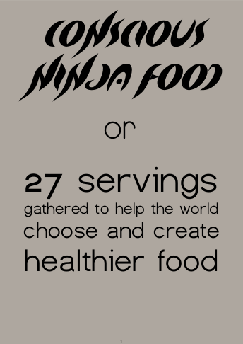

\[caption id="attachment\_4127" align="alignnone" width="344"\] click the image above to download the e-book\[/caption\]

**What kind of food is it?**

The food is based on a plant-based or vegan diet with mainly fruits, legumes, nuts, seeds and vegetables, made into quick, easy, affordable yet appetizing, appealing and nutritionally balanced meals.

More recipes and photos for inspiration are available on [my food blog](https://beyondhealthyfood.wixsite.com/beyond-healthy-food) and [food instagram account.](https://www.instagram.com/beyond_healthy_food)

If you enjoy the book and the content on the blog and Instagram, you can send a donation. Around $10/€10/100SEK is a fair amount, but it is up to you.

How to donate:

1. Click on 'Support' in the site menu follow the instructions.
2. Fill in the contact form with your name, email and write 'food' in the message field.
