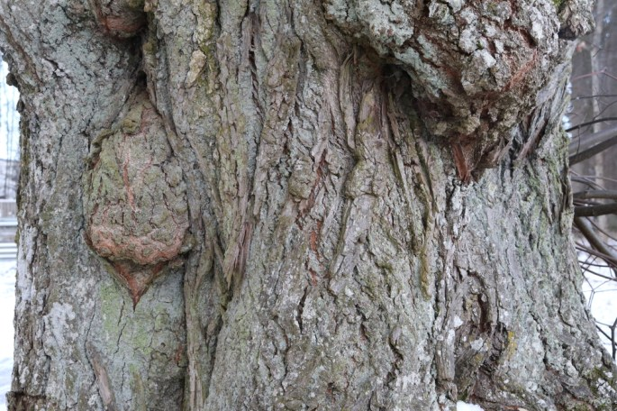
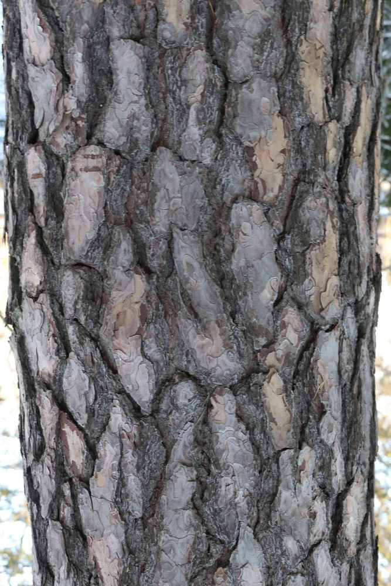
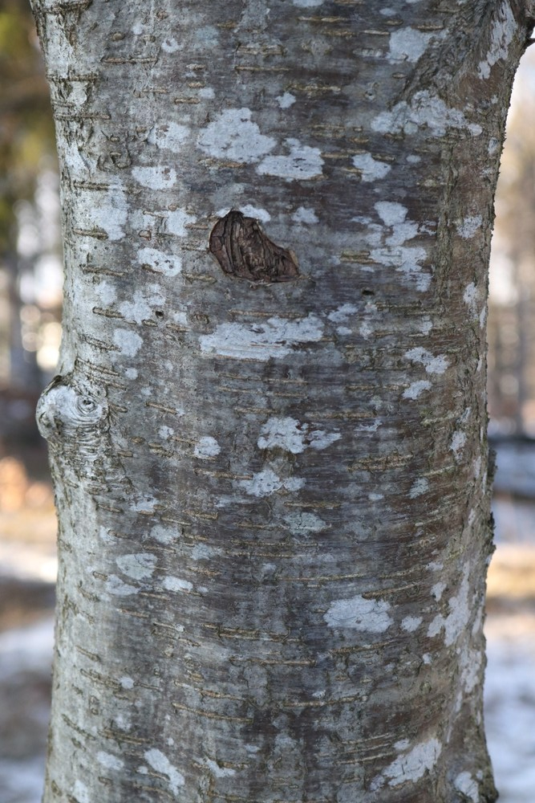
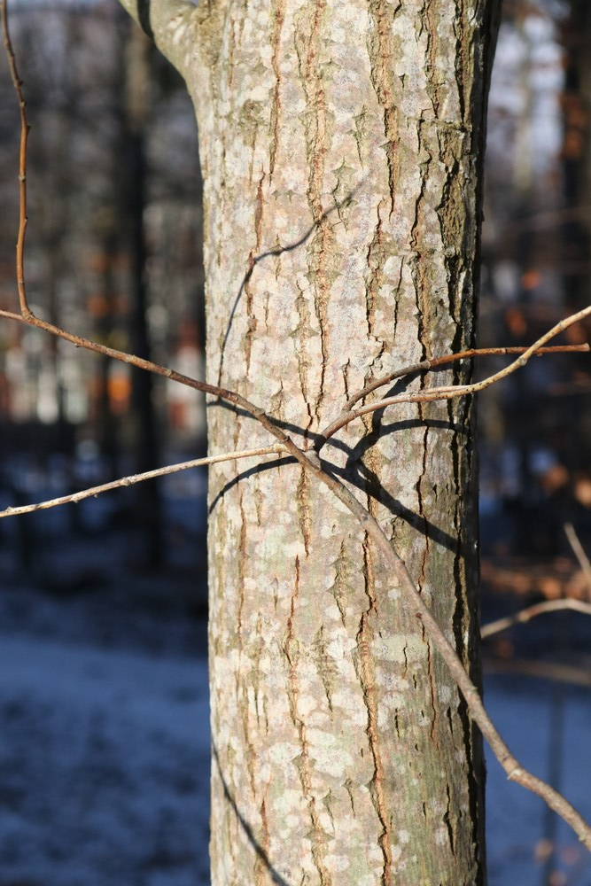
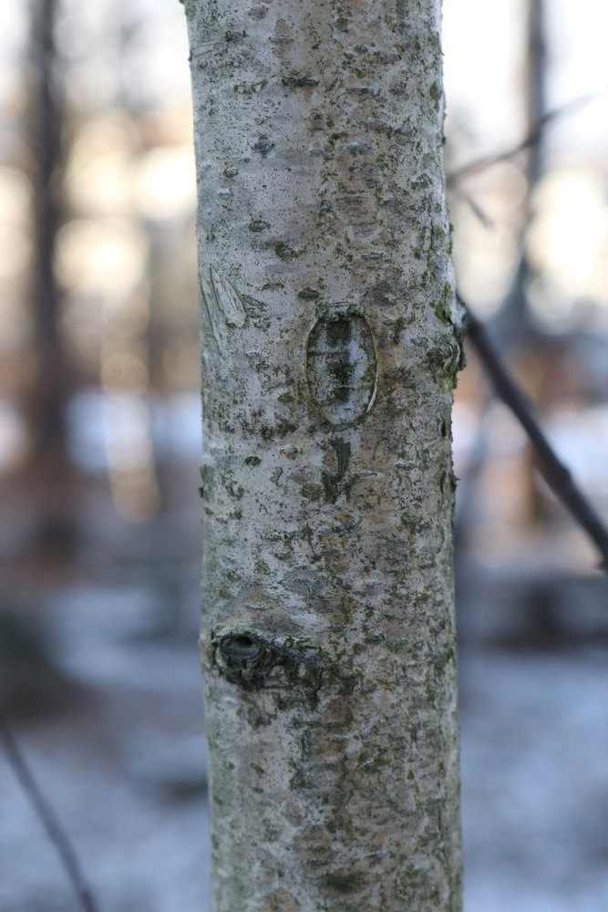
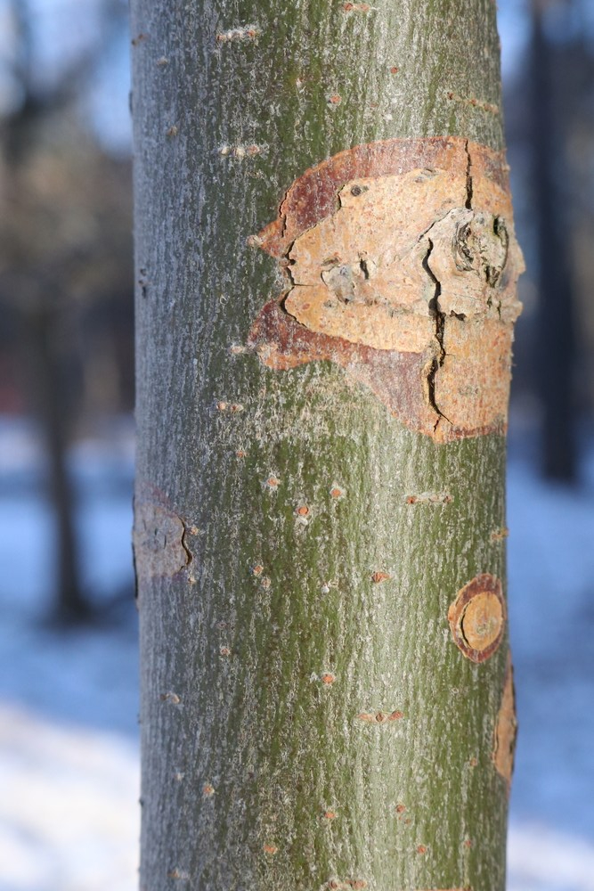
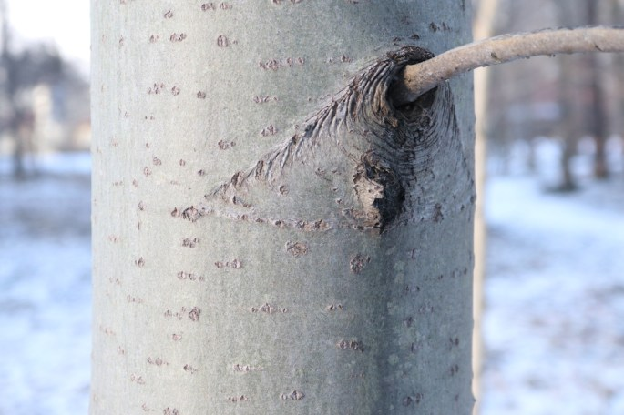
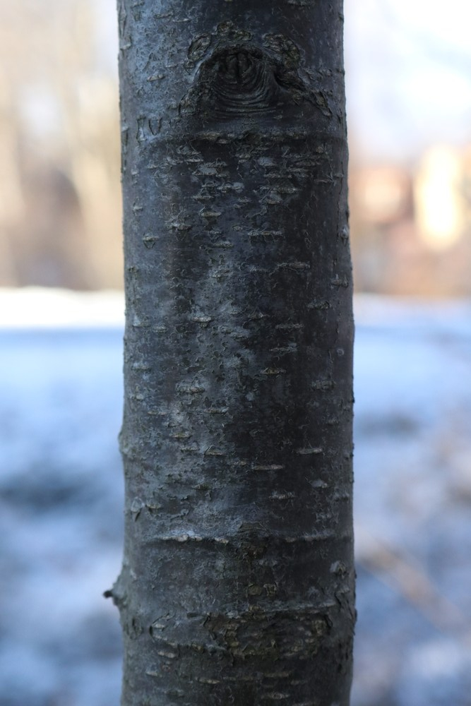
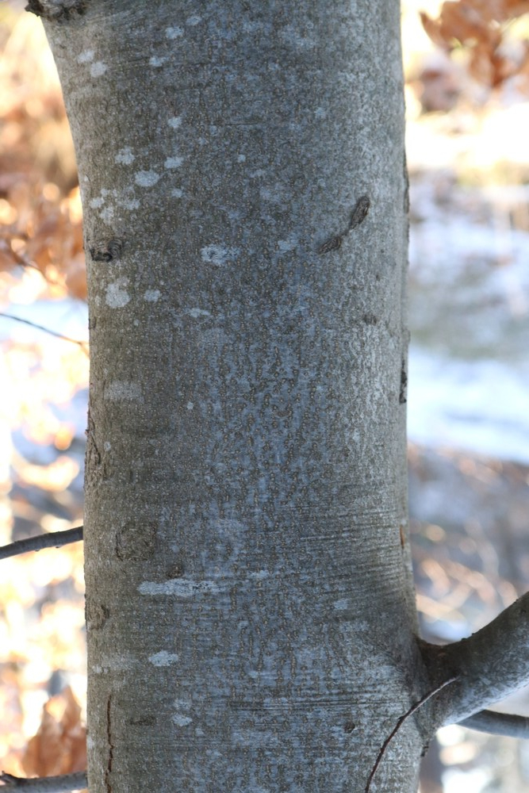
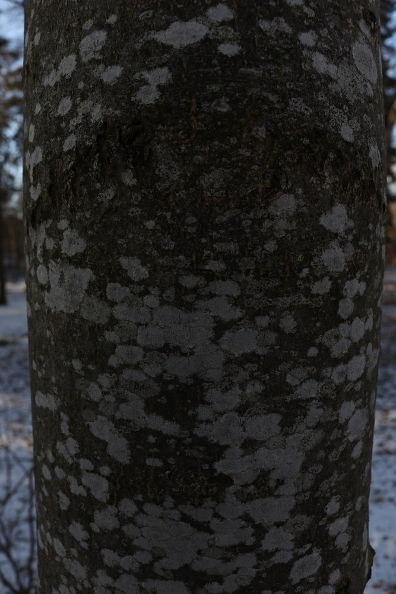

- <figure>
    
    
    
    <figcaption>
    
    wych elm
    
    </figcaption>
    
    </figure>
    
- <figure>
    
    
    
    <figcaption>
    
    wild cherry
    
    </figcaption>
    
    </figure>
    
- <figure>
    
    
    
    <figcaption>
    
    spruce
    
    </figcaption>
    
    </figure>
    
- <figure>
    
    
    
    <figcaption>
    
    small-leaved lime
    
    </figcaption>
    
    </figure>
    
- <figure>
    
    
    
    <figcaption>
    
    silver birch
    
    </figcaption>
    
    </figure>
    
- <figure>
    
    
    
    <figcaption>
    
    scots pine
    
    </figcaption>
    
    </figure>
    
- <figure>
    
    
    
    <figcaption>
    
    rowan
    
    </figcaption>
    
    </figure>
    
- <figure>
    
    
    
    <figcaption>
    
    hazel
    
    </figcaption>
    
    </figure>
    
- <figure>
    
    
    
    <figcaption>
    
    goat willog
    
    </figcaption>
    
    </figure>
    
- <figure>
    
    
    
    <figcaption>
    
    european hornbeam
    
    </figcaption>
    
    </figure>
    
- <figure>
    
    
    
    <figcaption>
    
    english oak
    
    </figcaption>
    
    </figure>
    
- <figure>
    
    
    
    <figcaption>
    
    downy birch
    
    </figcaption>
    
    </figure>
    
- <figure>
    
    
    
    <figcaption>
    
    crack willow
    
    </figcaption>
    
    </figure>
    
- <figure>
    
    
    
    <figcaption>
    
    common aspen
    
    </figcaption>
    
    </figure>
    
- <figure>
    
    
    
    <figcaption>
    
    black alder
    
    </figcaption>
    
    </figure>
    
- <figure>
    
    
    
    <figcaption>
    
    Bird Cherry
    
    </figcaption>
    
    </figure>
    
- <figure>
    
    
    
    <figcaption>
    
    beech
    
    </figcaption>
    
    </figure>
    
- <figure>
    
    
    
    <figcaption>
    
    ash
    
    </figcaption>
    
    </figure>
