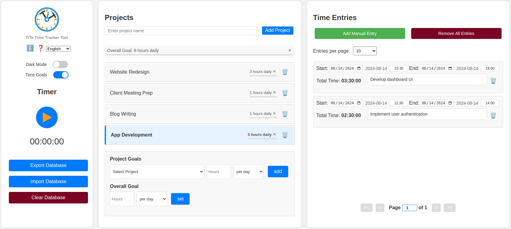
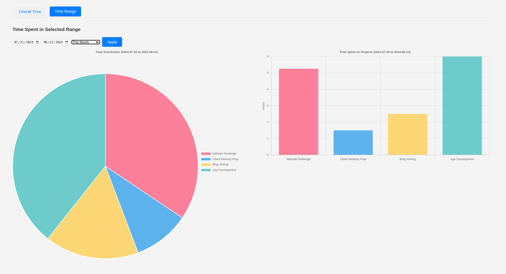
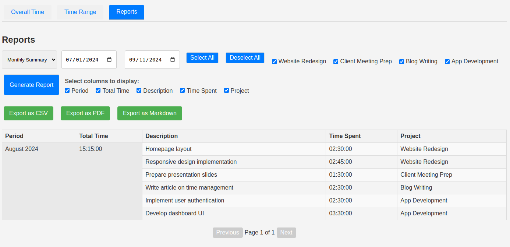
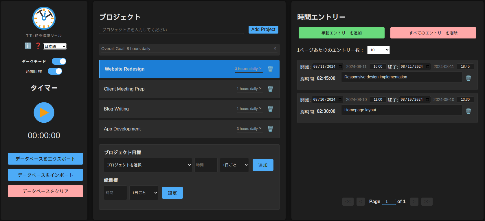
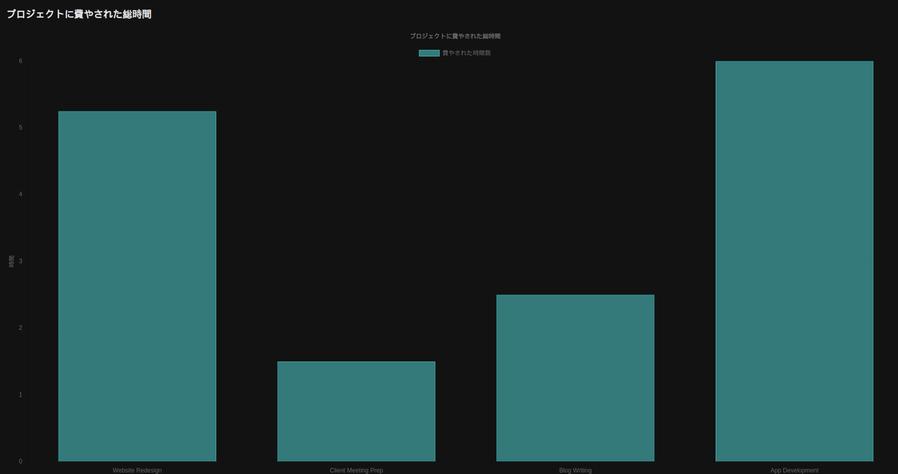
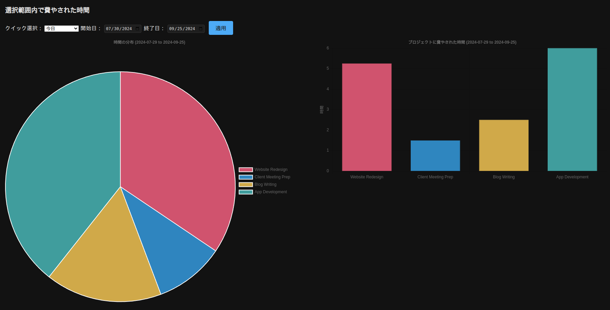

* * *

TiTo Time Tracker is a simple, efficient web application for tracking time spent on various projects. It allows users to manage projects, record time entries, and visualize their time allocation.

[Try TiTo Online](https://bjornkennethholmstrom.github.io/TiTo/) or [DOWNLOAD TiTo 1.11.0 (ZIP file)](https://bjornkennethholmstrom.wordpress.com/wp-content/uploads/2025/07/tito-1.11.0.zip)

## Features

**Core User Experience**

- Clean three-column layout

- Multi-lingual support (English, Swedish, Spanish, Basque, French, German and Japanese)

- Dark mode

- Support for screen reader (tested with Orca on Linux Mint)

- Support for keyboard navigation (tested in Chrome on Linux Mint)

- Help modal

- Info icon for quick access to app info and links

**Core Time Tracking**

- Start and stop a timer for active time tracking

- Add manual time entries

- View and edit time entries with custom dates and time inputs

- Create and manage multiple projects

- Drag-and-drop interface for reordering projects and time entries

**Time Entry Management**

- Paginated time entries list with customizable entries per page (5, 10, 20, 30, custom, or all)

- Editable page number for quick navigation through time entries

- Clear all button for entries

**Reporting and Visualization**

- Charts displaying time spent on different projects:
    - Overall time distribution
    
    - Time spent in selected time ranges

- Monthly or weekly reports with export to CSV, PDF, or markdown

- Date range selection for detailed data analysis

**Technical and Functional**

- Local data storage using IndexedDB

- Import/Export of database from/into .JSON-file for backup and transfer

- Offline functionality – works entirely in the browser

**Technical stack**

- Built with vanilla JavaScript, HTML, and CSS

## **Recent Updates**

Version 1.11.0

- Fixed time ranges for reports

- Added daily report

Version 1.10.0

- Added time goals

Version 1.09.0

- Removed unnecessary pause functionality.

- Adapt timer button to dark/light mode

Version 1.08.2

- Make time entries adhere to local time zone

Version 1.08.1

- Added dark mode

- Added support for French, German and Japanese

- Added icon

## **Planned Features**

- Customizable report templates

- More data visualization

- More languages, per request

- TiTo as browser extensions

- TiTo app

## Known Issues

- Keyboard navigation does not work in Firefox

- Project list in time goals section does not update immediately upon import of database, only after page is refreshed.

## Installation and Usage

1. Download the TiTo Time Tracker 1.10.0 zip-file from the link below

3. Extract the contents of the zip file to a location on your computer.

5. Open the extracted folder and find the `index.html` file.

7. Double-click on `index.html` to open it in your default web browser.

##### _Recommended: Create a Bookmark_

For quick and easy access to TiTo Time Tracker, create a bookmark in your browser:

1. Open the `index.html` file in your browser as described above.

3. Create a bookmark in your browser (usually by pressing Ctrl+D or Cmd+D, or by clicking the star icon in the address bar)

5. Optionally, move the bookmark to your bookmarks bar for one-click access.

This will allow you to open the time tracker quickly whenever you need it, enhancing your productivity.

## Download and Online version

[Download TiTo 1.11.0 (ZIP file)](https://bjornkennethholmstrom.wordpress.com/wp-content/uploads/2025/07/tito-1.11.0.zip)

[Try TiTo Online (GitHub Pages)](https://bjornkennethholmstrom.github.io/TiTo/)

## Contributing

Feel free to suggest features on my [contact page](https://bjornkennethholmstrom.wordpress.com/contact/). If you would like to support the project you can [donate here](https://www.paypal.com/donate/?hosted_button_id=FX7FQMDQBAR4N) (please write TiTo in the donation message)

## License

TiTo is released under a custom license. For more details, please see the LICENSE file included in the download or repository.

## Acknowledgments

Built with the assistance of Claude 3.5 & 4 Sonnet, an AI assistant created by Anthropic.

## SCREENSHOTS

