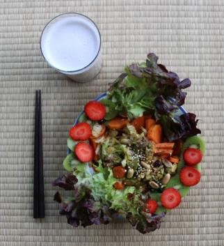

_~ lettuce sail for new experiences ~_

**Ingredients**

_fresh_

- Almonds

- Cabbage

- Carrots

- Garlic

- Kiwi

- Red coral lettuce

- Spinach

- Strawberries

- Sweet potato

- Water

_dry_

- Dried cranberries **_or_** raisins

- Peanuts

- Quinoa puffs

**Preparation**

1. Peel and chop half a sweet potato

3. Boil the pieces for 10 to 15 minutes

5. Fry minced garlic with sliced carrots in olive oil

7. After a few minutes, add finely chopped cabbage and spinach

9. Stir fry until the cabbage gets a bit of color

11. Season with soy sauce

13. Add dried cranberries or raisins and the sweet potato pieces

15. Continue stir frying for a few minutes

17. Serve on a plate

19. Add peanuts, quinoa puffs, red coral lettuce, kiwi and strawberries

Bonus: to make almond milk

1. Leave almonds in water overnight

3. Rinse and put the almonds together with water in a blender

5. Blend and strain to separate the liquid from the pulp

7. Use the pulp for something else, like the bread spread described on this page: [http://bjornkennethholmstrom.wordpress.com/recipes-bread-with-almond-spread](http://bjornkennethholmstrom.wordpress.com/recipes-bread-with-almond-spread)
