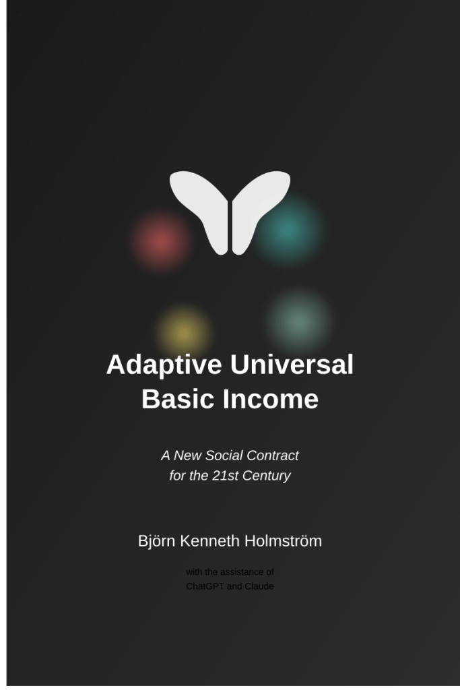
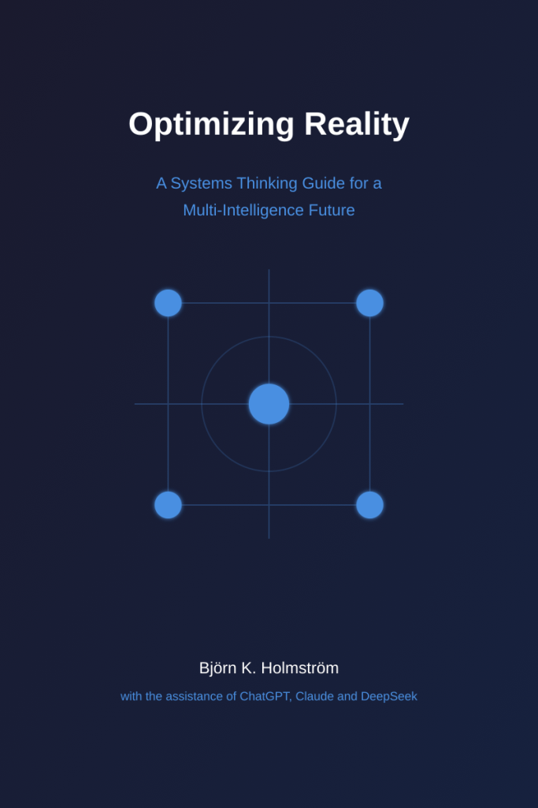
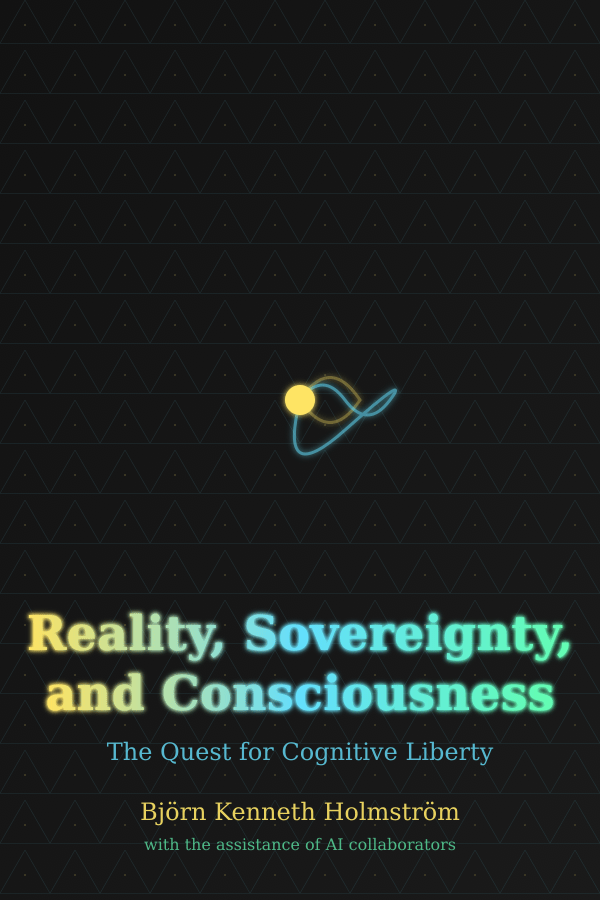
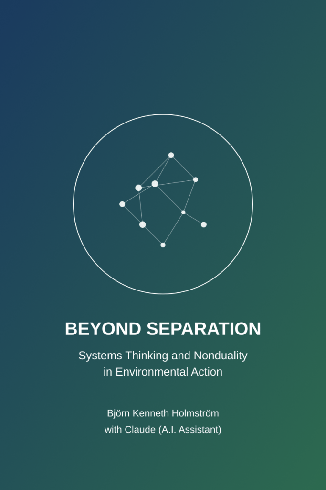
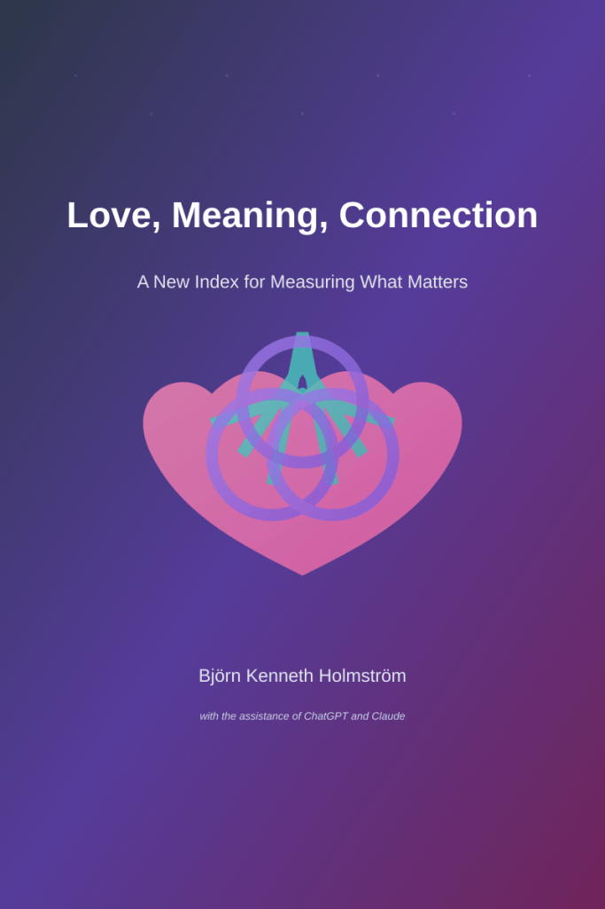

Here are books by me. They are all free to share without restrictions, as long as they are kept in their original form. Click on the cover or title of a book to open its summary page.

* * *

[AI as Catalyst for Cognitive Evolution: From Fragmentation to Integration in the Age of AI](https://bjornkennethholmstrom.wordpress.com/ai-as-catalyst-for-cognitive-evolution-from-fragmentation-to-integration-in-the-age-of-ai/)

This book explores how humanity can consciously partner with artificial intelligence, using it as a 'cognitive scaffold' to accelerate the leap from the fragmented 'Tier 1' thinking that drives the polycrisis to the integrated 'Tier 2' consciousness required for a flourishing future.

[\[Download as PDF\]](https://globalgovernanceframeworks.org/resources/AI_as_Catalyst_for_Cognitive_Evolution_-_From_Fragmentation_to_Integration_in_the_Age_of_AI.pdf)

* * *

[Global Governance: Natural Steps Toward a Thriving World](https://bjornkennethholmstrom.wordpress.com/global-governance-natural-steps-toward-a-thriving-world-2/)

A practical roadmap for creating an ethical, decentralized global governance system that can address planetary-scale challenges through systems thinking, cutting-edge technology, and deep human wisdom.  
[\[Download as PDF\]](https://bjornkennethholmstrom.wordpress.com/wp-content/uploads/2025/02/global-governance-natural-steps-toward-a-thriving-world-2.pdf)

* * *

[Adaptive Universal Basic Income: A New Social Contract for the 21st Century](https://bjornkennethholmstrom.wordpress.com/adaptive-universal-basic-income-a-new-social-contract-for-the-21st-century/)

A comprehensive framework for reimagining economic security that responds dynamically to individual needs while encouraging meaningful societal contributions, offering practical implementation strategies at local, national, and global scales.

[\[Download as PDF\]](https://bjornkennethholmstrom.wordpress.com/wp-content/uploads/2025/02/adaptive-universal-basic-income-a-new-social-contract-for-the-21st-century-1.pdf)

[\[Download as PDF (Swedish)\]](https://bjornkennethholmstrom.wordpress.com/wp-content/uploads/2025/02/adaptiv-universell-basinkomst-ett-nytt-socialt-kontrakt-for-2000-talet.pdf)

* * *

[Optimizing Reality: A Systems Thinking Guide For a Multi Intelligence Future](https://bjornkennethholmstrom.wordpress.com/optimizing-reality-a-systems-thinking-guide-for-a-multi-intelligence-future/)  
[\[Download as PDF\]](https://bjornkennethholmstrom.wordpress.com/wp-content/uploads/2025/02/optimizing-reality.pdf)

An actionable blueprint for integrating human, artificial, ecological, and collective intelligence to create more harmonious and sustainable systems across governance, economics, and environmental stewardship.

* * *

[Reality, Sovereignty, and Consciousness: The Quest for Cognitive Liberty](https://bjornkennethholmstrom.wordpress.com/reality-sovereignty-and-consciousness-the-quest-for-cognitive-liberty/)

An exploration of who owns your mind, examining the intersection of personal freedom, consciousness exploration, and societal transformation while offering frameworks for responsible exploration and policy reform.

[\[Download as PDF\]](https://bjornkennethholmstrom.wordpress.com/wp-content/uploads/2025/02/reality-sovereignty-and-consciousness.pdf)

* * *

[Regenerative Reciprocity: Systems, Spirituality, and the Ethics of Sustenance in a Diverse World](https://bjornkennethholmstrom.wordpress.com/regenerative-reciprocity-systems-spirituality-and-the-ethics-of-sustenance-in-a-diverse-world-2/)

A book about reconnecting humans with nature and each other through a framework that combines systems thinking, spiritual wisdom, and practical action, showing how we can shift from extractive to regenerative ways of living that honor the interconnectedness of all life.

[\[Download as PDF\]](https://bjornkennethholmstrom.wordpress.com/wp-content/uploads/2025/02/regenerative-reciprocity-systems-spirituality-and-the-ethics-of-sustenance-in-a-diverse-world.pdf)

* * *

[Beyond Separation: Systems Thinking and Nonduality in Environmental Action](https://bjornkennethholmstrom.wordpress.com/beyond-separation-systems-thinking-and-nonduality-in-environmental-action-2/)

This book integrates systems thinking with nondual awareness to address the root causes of our environmental challenges, offering a transformative framework that transcends fragmentation to create more effective, holistic approaches to ecological healing and sustainability.

* * *

[Love, Meaning, Connection: A New Index for Measuring What Matters](https://bjornkennethholmstrom.wordpress.com/love-meaning-connection-a-new-index-for-measuring-what-matters-2/)

A revolutionary guide that challenges traditional economic metrics by introducing a framework to measure human flourishing through our deepest relationships, sense of purpose, and connections to ourselves, others, and the world around us.

[\[Download as PDF\]](https://bjornkennethholmstrom.wordpress.com/wp-content/uploads/2025/02/love-meaning-connection-a-new-index-for-measuring-what-matters-1.pdf)

* * *

[The Divine System: A Systems Thinking Approach to God, Spirituality, and Reality](https://bjornkennethholmstrom.wordpress.com/the-divine-system-a-systems-thinking-approach-to-god-spirituality-and-reality/)  
[\[Download as PDF\]](https://bjornkennethholmstrom.wordpress.com/wp-content/uploads/2025/02/the-divine-system.pdf)

A bridge between ancient spiritual wisdom and modern analytical frameworks that examines religious and mystical traditions as complex, self-organizing networks of meaning and experience.

* * *

[Being: A Tapestry of Existence Through Systems and Poetry](https://bjornkennethholmstrom.wordpress.com/being-a-tapestry-of-existence-2/)

A book exploring what it means to exist through both systems thinking and poetic experience, weaving together philosophy, science, and spirituality to understand the interconnected yet deeply personal nature of being.

[\[Download as PDF\]](https://bjornkennethholmstrom.wordpress.com/wp-content/uploads/2025/02/being-a-tapestry-of-existence.pdf)

* * *

[Mystical Mathematics: Where Number Meets Being](https://bjornkennethholmstrom.wordpress.com/mystical-mathematics-where-number-meets-being-2/)

A contemplative exploration of mathematics as a sacred language, revealing how number, pattern, and form connect the visible world to the invisible—inviting readers to recognize mathematics not just as a tool for calculation, but as a doorway to meaning and presence.

[\[Download as PDF\]](https://bjornkennethholmstrom.wordpress.com/wp-content/uploads/2025/03/mystical-mathematics-where-number-meets-being-2.pdf)
