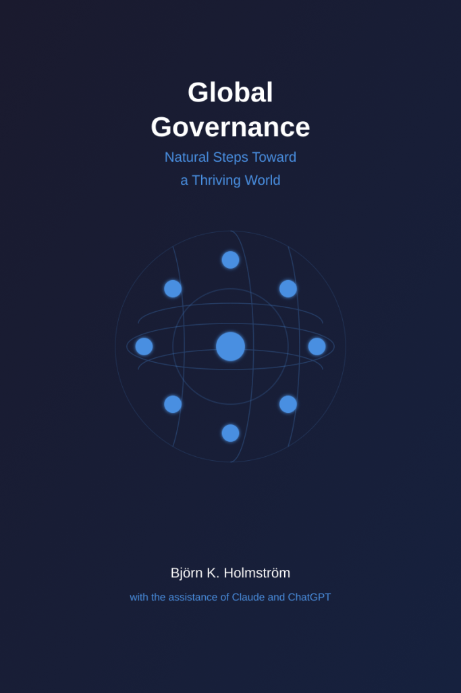

[\[Download the book as PDF\]](https://bjornkennethholmstrom.wordpress.com/wp-content/uploads/2025/02/global-governance-natural-steps-toward-a-thriving-world-2.pdf)

* * *

As humanity faces unprecedented global challenges—from climate change and artificial intelligence to economic inequality and space exploration—our fragmented system of national governance is failing to address these planetary-scale issues. We need a new approach.

"Global Governance: Natural Steps Toward a Thriving World" presents a practical roadmap for creating an ethical, decentralized, and participatory global governance system. This groundbreaking book combines systems thinking, cutting-edge technology, and deep human wisdom to outline how we can:

- Build fair economic systems through Adaptive Universal Basic Income (AUBI) and transparent resource distribution

- Use artificial intelligence to enhance democracy rather than replace it

- Protect cultural diversity while enabling global cooperation

- Ensure sustainable planetary stewardship and ethical space exploration

- Create governance systems that serve all of humanity, not just wealthy nations or corporations

At the heart of this vision lies a set of twelve foundational principles—including Decentralized Authority, Radical Transparency, Environmental Stewardship, and Resource Justice—that provide an ethical framework for constitutional global governance. These principles balance universal values with cultural diversity, technological advancement with human autonomy, and global cooperation with local self-determination.

Written through an innovative collaboration between human vision and artificial intelligence, this book demonstrates how technology can amplify human wisdom while maintaining human agency. It offers not just theory, but practical steps that individuals, communities, and nations can take today to build a more ethical and sustainable world.

From reforming global institutions and implementing economic fairness to protecting mental sovereignty in an AI-driven age, "Global Governance" provides a comprehensive framework for transitioning from our current system of competing nations to a unified civilization capable of addressing 21st-century challenges.

This is not a utopian vision—it is a practical guide to creating the world we know is possible. The future of governance is not control, but cooperation. Let's build it together.

* * *
