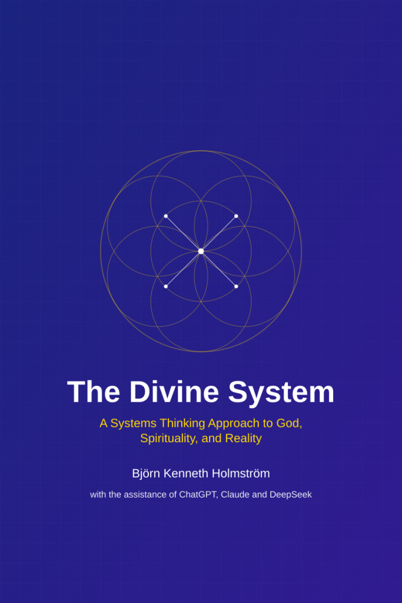

[\[Download the book as PDF\]](https://bjornkennethholmstrom.wordpress.com/wp-content/uploads/2025/02/the-divine-system.pdf)

* * *

This groundbreaking exploration of spirituality through the lens of systems thinking bridges ancient wisdom with modern analytical frameworks. _The Divine System_ examines how religious and mystical traditions can be understood as complex, self-organizing networks of meaning and experience.

Drawing from diverse sources—from Ibn Arabi's mystical philosophy to cybernetics, from Indigenous wisdom to quantum physics—this book reveals patterns of divine intelligence manifesting through:

- Self-regulating spiritual and moral systems

- Feedback loops in religious experience and practice

- Fractal patterns in sacred geometry and cosmic order

- Emergent properties in consciousness and revelation

The book challenges traditional divisions between science and spirituality, suggesting that systems thinking offers a unified framework for understanding both material and divine reality. Through careful analysis of religious organizational structures, sacred texts, and mystical experiences, it demonstrates how spiritual traditions function as adaptive, evolving systems rather than rigid frameworks.

As humanity faces unprecedented technological and existential challenges, _The Divine System_ offers fresh perspectives on:

- How religious traditions evolve and adapt

- The role of consciousness in shaping reality

- The future of spiritual practice in an AI-driven world

- The limits of rational thought in understanding the divine

This innovative work will appeal to:

- Spiritual seekers looking for modern frameworks to understand ancient wisdom

- Systems thinkers interested in religious and mystical dimensions

- Scholars exploring the intersection of science and spirituality

- Anyone curious about the deeper patterns underlying reality

Neither purely religious nor purely scientific, _The Divine System_ charts new territory in our understanding of spirituality, consciousness, and the nature of existence itself.

* * *
