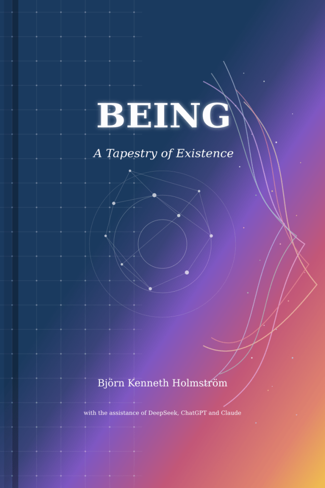

[\[Download as PDF\]](https://bjornkennethholmstrom.wordpress.com/wp-content/uploads/2025/02/being-a-tapestry-of-existence.pdf)

At the intersection of systems thinking and poetic exploration lies a profound question: What does it mean to exist? In this groundbreaking book, readers are invited on a journey into the heart of being itself—not as a problem to be solved, but as a mystery to be lived.

From the physical foundations of existence to the cosmic dance of stars, from the shadows of suffering to the playfulness of creativity, this book weaves together multiple perspectives to create a tapestry of understanding about human experience. Drawing on philosophy, science, spirituality, and personal narrative, we explore how we exist within vast interconnected systems while simultaneously experiencing life as intimately personal.

"Being" challenges readers to see existence through both analytical and poetic lenses—to understand the patterns that connect all things while remaining open to wonder, mystery, and direct experience. Through thoughtful case studies, reflective exercises, and moments of poetic insight, it shows how awareness of being can transform everyday life, deepen relationships, and foster a more meaningful connection to the world.

Whether you're drawn to philosophical inquiry, spiritual contemplation, or simply the feeling of being fully alive, this book offers a fresh perspective on what it means to be human in an infinite universe—alone yet connected, temporary yet eternal, ordinary yet extraordinary.

A collaboration between human creativity and artificial intelligence, "Being: The Systems and Poetry of Existence" reminds us that the greatest adventure is not to conquer the world, but to experience it fully—to stand in awe before the simple miracle of existence itself.
