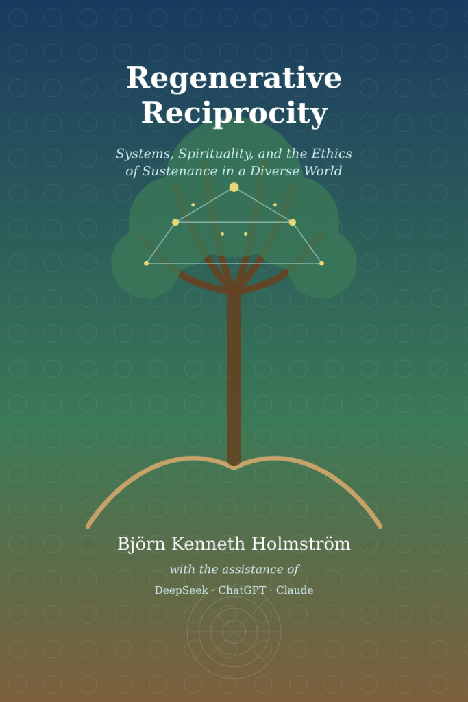

[\[Download book as PDF\]](https://bjornkennethholmstrom.wordpress.com/wp-content/uploads/2025/02/regenerative-reciprocity-systems-spirituality-and-the-ethics-of-sustenance-in-a-diverse-world.pdf)

In a world of profound disconnection—where we consume without awareness and extract without giving back—_Regenerative Reciprocity_ offers a timely and transformative vision for healing our relationship with the Earth and each other.

Drawing on systems thinking, diverse spiritual traditions, and practical wisdom, the book weaves together a holistic framework for ethical living that transcends false dichotomies between individual and collective action, spirituality and science, ancient wisdom and modern innovation.

This groundbreaking book invites readers to:

- Understand the complex web of relationships that sustain life and how we can design systems that regenerate rather than deplete

- Explore the sacred dimensions of food and consumption through spiritual perspectives across cultures

- Embrace diversity—ecological, cultural, and economic—as essential for resilience and creativity

- Navigate the tensions and trade-offs of ethical decision-making with compassion and wisdom

- Take practical steps toward regenerative living, from personal choices to community building to systemic change

More than a sustainability guide, _Regenerative Reciprocity_ is a call to reimagine our place in the world—not as separate from nature but as integral participants in the web of life. It offers a vision where abundance flows not from extraction but from reciprocity, where success is measured not by profit but by wellbeing, and where our actions honor the interconnectedness of all beings.

For anyone seeking to align their values with their actions and contribute to a more just, sustainable, and flourishing world, this book provides both inspiration and practical guidance for the journey ahead.
