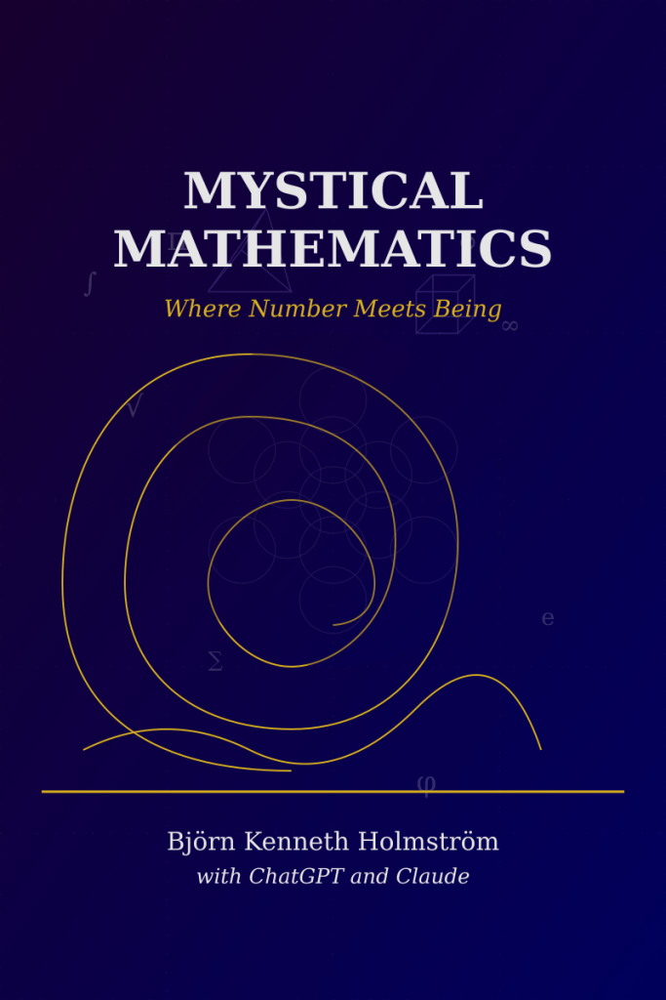

\[[Download book as PDF](https://bjornkennethholmstrom.wordpress.com/wp-content/uploads/2025/03/mystical-mathematics-where-number-meets-being-2.pdf)\]

**Mystical Mathematics: Where Number Meets Being** invites readers on a contemplative journey to the place where calculation meets meaning, where pattern touches presence. Through elegant prose and poetic insight, this book explores the sacred dimensions of mathematics—not as abstract theory, but as a living language that reveals the hidden harmonies of existence.

Beginning with the enigma of zero and the first distinction, the book spirals outward through sacred geometry, divine proportion, and the mystical structures found across human cultures. It then curves back to examine how mathematical insight transforms consciousness itself. Drawing inspiration from Pythagoras, Plato, and modern thinkers, while honoring wisdom traditions from East and West, this exploration reveals how number is not merely a tool for counting, but a doorway to meaning.

Neither a traditional mathematics text nor a conventional spiritual treatise, **Mystical Mathematics** occupies the fertile threshold between precision and wonder. It speaks to readers who sense that there is something more to mathematics than utility—something that resonates with the deepest currents of being.

In a world often fragmented by specialization, this book offers a reunification of knowledge and wisdom, showing how the patterns that structure reality might also illuminate the soul. It invites us to remember what the ancients knew: that number is not just something we use, but something we are.
