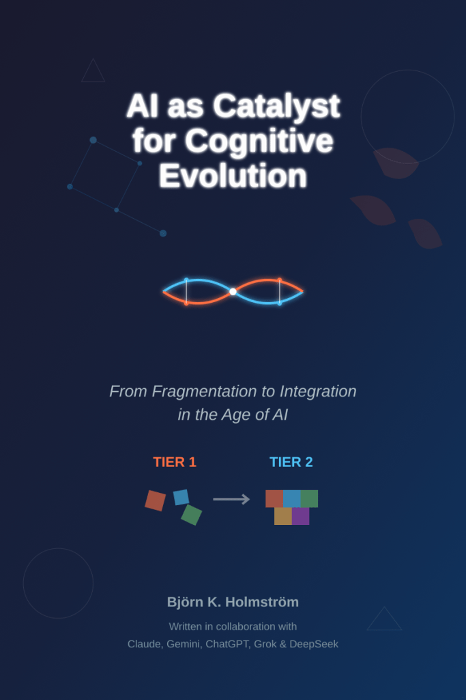

[\[Download the book as PDF\]](https://globalgovernanceframeworks.org/resources/AI_as_Catalyst_for_Cognitive_Evolution_-_From_Fragmentation_to_Integration_in_the_Age_of_AI.pdf)

**The most important choice of the 21st century isn't about artificial intelligence—it's about human consciousness.**

We face 21st-century challenges that require ways of thinking most of humanity hasn't yet developed. Climate change, economic inequality, political polarization, and the erosion of shared truth are "wicked problems" that cannot be solved from any single perspective. They demand what developmental psychology calls "Second Tier" consciousness—the ability to hold multiple viewpoints simultaneously, think systemically across domains, and integrate apparent contradictions.

Yet only 2-5% of the global population has naturally developed these cognitive capacities. This creates a profound "cognitive gap" between the complexity of our challenges and our collective ability to respond wisely.

Enter artificial intelligence—not as our replacement, but as our most powerful catalyst for conscious evolution.

**AI amplifies whatever consciousness we bring to it.** Developed from fragmented thinking, it produces algorithmic bias, political polarization, and surveillance dystopia. But approached with integral awareness, AI can serve as cognitive scaffolding, helping us develop the multi-perspective synthesis our planetary civilization desperately needs.

This groundbreaking book reveals how conscious AI partnership could trigger humanity's next developmental leap—from the tribal, ideological, and competitive thinking that created our crises to the collaborative wisdom needed to solve them. Through vivid scenarios ranging from breakthrough to breakdown, it shows four possible futures and the choices that will determine which we inhabit.

More than a book about technology, this is a roadmap for the greatest transformation in human history: the conscious evolution of consciousness itself. At stake is nothing less than whether we become a planetary intelligence capable of thriving with artificial intelligence, or remain cognitively trapped while our challenges outpace our ability to respond.

**The future depends not on what AI becomes, but on what we become as we develop it.**

The choice is ours. The moment is now. The invitation to conscious evolution has never been more urgent—or more possible.

_"A masterful synthesis that transforms the AI conversation from fear-based reactions to conscious responses. This book doesn't just explain our predicament—it lights the path forward."_

_"Essential reading for anyone who wants to understand not just how AI will change the world, but how we must change ourselves to navigate that transformation wisely."_
