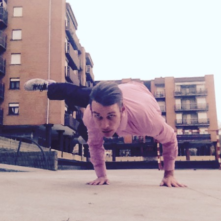

_"Calisthenics; from Greek 'kallos', meaning perfect, and 'sthenos' meaning strength._ _Many view calisthenics as the art of moving unhindered through space."_

\[caption id="attachment\_2078" align="alignnone" width="450"\] Perhaps my favorite hand balance\[/caption\]

This page will be updated with a workout program, as soon as I get my routine going!

Until then, some of my favorite exercises:

#### Dynamic

**Beginner**

- Calf raises
- Wide pushups (on knees if necessary)
- Hanging tucked leg lifts
- Squats

**Intermediate**

- Bulgarian squats
- Dips on parallel bar or side support
- Dips on horizontal bar
- Leg lifts
- Pushups
- Pull-ups
- Chins
- Hanging rows with leg support

**Advanced**

- Archer pushups
- Dragon flags
- Handstand pushups
- Korean dips
- One-leg squats

**Expert**

#### Static

**Beginner**

- Hanging tucked L-sit

**Intermediate**

- Hanging L-sit
- Supported handstand
- Frog hand balance

**Advanced**

- Free handstand
- L-sit a parallel or horizontal bar or on the floor/ground
- Tucked front lever
- Tucked planche
- Back lever
- Straddled V-sit

**Expert**

- Front lever
- V-sit
