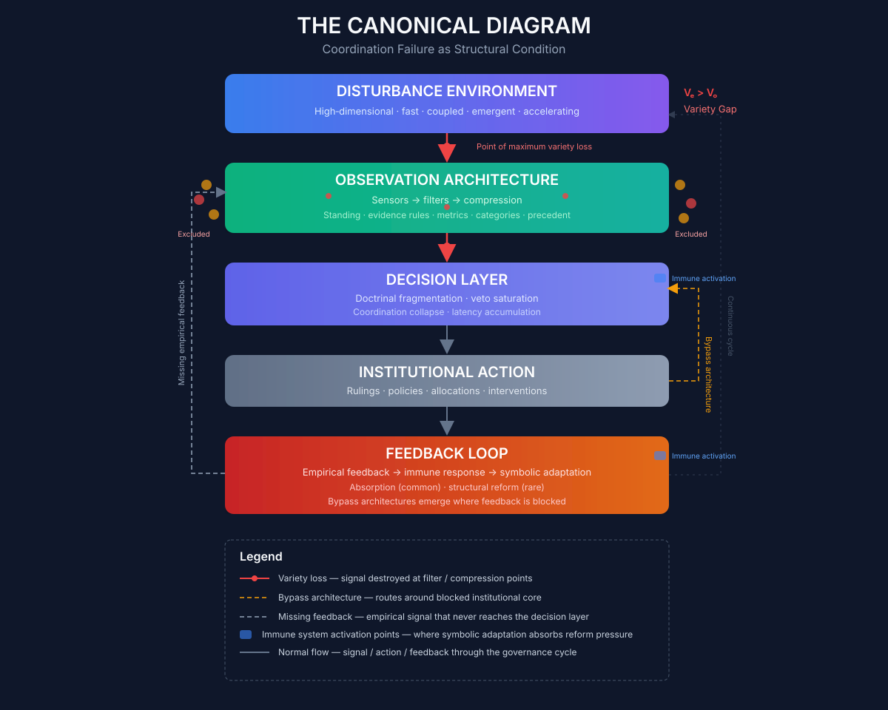

# Chapter 3
## The Variety Gap

In the spring of 2011, a senior economist at the European Central Bank presented a paper at a closed-door seminar on the outlook for the eurozone. The paper was technically accomplished, methodologically rigorous, and broadly reassuring. Its models projected that the currency union was fundamentally stable. Its stress tests showed that the banking system could withstand a range of adverse scenarios. Its analysis of sovereign bond markets suggested that the spreads between German and peripheral debt reflected temporary liquidity pressures rather than fundamental solvency concerns. The seminar participants—the best-trained macroeconomists on the continent, working in one of the world's most sophisticated policy institutions—discussed the paper with the collegial rigour that technocratic culture demanded. They raised questions about the model's calibration, about the assumptions embedded in the stress tests, about the sensitivity of the results to parameter variation. They did not raise the question of whether the entire framework was observing the right dimensions. That question was, in a precise sense, unaskable from within the framework itself.

Within eighteen months, the eurozone would be in the grip of a sovereign debt crisis that threatened the survival of the currency union. The dimensions along which the crisis developed—the feedback loop between bank balance sheets and sovereign borrowing costs, the political economy of adjustment within member states, the fragility of cross-border interbank lending markets, the inadequacy of the institutional mechanisms for fiscal coordination among sovereign nations—were dimensions that the ECB's models had systematically excluded. The models were not wrong in any simple sense. They were accurate representations of the economy they had been designed to observe. They were simply observing too few dimensions of the economy that actually existed.

This is the Variety Gap: the structural mismatch between the dimensionality of the disturbance environment that an institution must govern and the dimensionality of that institution's observation architecture. The concept is precise enough to anchor the argument of the remainder of this book, and general enough to apply across every domain the book examines. It is the Rosetta Stone that makes the pattern introduced in Chapter 1 and the historical dynamic introduced in Chapter 2 intelligible as a unified phenomenon rather than a collection of interesting but unrelated cases. And it is, ultimately, the diagnostic tool that makes the design principles of Part IV possible.

---

### What Variety Means

The term "variety" is used in this book in the specific sense that the cybernetician W. Ross Ashby gave it in 1956. A system's variety is the number of distinct states it can occupy—the range of configurations available to it. A thermostat that can register two states (too hot, too cold) has less variety than one that can register a continuous temperature range. A medical diagnosis that categorises patients into "mild," "moderate," and "severe" has less variety than one that captures the specific combination of conditions, history, and circumstances that characterise an individual patient. A representation system that compresses the full distribution of citizen preferences into a choice between two candidates has less variety than one that registers preference intensity across multiple dimensions.

Ashby's Law of Requisite Variety, one of the foundational results of cybernetics, states that a controller can only stabilise a system if the controller's variety matches or exceeds the variety of the system it is trying to govern. Formally: for a regulator to maintain a system within a desired set of states, the regulator must be able to register and respond to at least as many distinct states as the disturbances that can push the system out of bounds. If the regulator's variety is insufficient, the unabsorbed variety appears as uncontrolled variance in the outcomes—crises, collapses, and failures that the regulator cannot anticipate and cannot correct.

This is not a guideline, a heuristic, or a design principle. It is a theorem. No institutional arrangement, however well-intentioned, well-resourced, or well-staffed, can stabilise a system whose variety exceeds its own. The mathematics does not make exceptions for democratic legitimacy, technocratic expertise, or historical achievement.

The governance implication is direct and uncomfortable. Every institution observes the world it governs through a particular set of channels—metrics, indicators, reporting chains, categories of evidence. Those channels select a subset of the world's dimensions for institutional attention and consign everything else to noise. The institution can only respond to what it can perceive. The dimensions it cannot perceive do not cease to operate. They accumulate as externalities—unpriced, unmeasured, unaccounted—until they force themselves into visibility through crisis. The gap between the dimensionality of the world and the dimensionality of the observation channel is the Variety Gap. And when it exceeds a critical threshold, the institution becomes constitutionally incapable of perceiving the threats that will eventually destabilise it.

The concept is abstract, but its manifestations are concrete and often devastating. The central bank that monitors inflation, output, and employment through a single interest rate instrument has an observation architecture of very low dimensionality—effectively two or three independent signal dimensions. The economy it governs has dimensionality orders of magnitude larger. The excluded dimensions—asset price dynamics, private-sector leverage, credit allocation quality, distributional effects, climate exposure, cross-border capital flows—accumulate as financial fragility, political grievance, and ecological risk until they force a crisis that the existing framework cannot anticipate. The 2008 crisis was a Variety Gap crossing. The sovereign debt crisis that followed was another. The next one—perhaps involving the interaction of climate risk, sovereign insolvency, and the unwinding of central bank balance sheets—is accumulating now, in dimensions that the current observation architecture still excludes.

The hospital that monitors patient throughput, procedure volumes, and diagnostic codes through an electronic health record optimised for billing has an observation architecture of very low dimensionality relative to the clinical reality of the individual patient. The excluded dimensions—care coordination, patient context, social determinants, clinical complexity—accumulate as preventable deterioration, clinician burnout, and the progressive degradation of the clinical signal. The dashboard shows a functioning hospital. The patient experiences a system that cannot see them.

The university that monitors citation metrics, journal placements, and departmental rankings has an observation architecture of very low dimensionality relative to the knowledge it produces. The excluded dimension is integration: the capacity to assemble specialised knowledge across disciplinary boundaries into coherent understanding of the multidimensional problems that the world actually presents. The climate scientist and the sociologist pass each other in the corridor, possessing collectively all the knowledge needed to understand climate change, with no institutional pathway to assemble what they know. The university's observation architecture registers their individual productivity with great precision. It cannot register the integration that is not happening.

The AI laboratory that monitors capability benchmarks, deployment velocity, and competitive positioning has an observation architecture of very low dimensionality relative to the societal consequences of the technologies it develops. The excluded dimensions—alignment risk, labour market disruption, epistemic infrastructure degradation, geopolitical fragility—accumulate as externalities that the laboratory's incentive structure actively discourages it from perceiving. The dashboard shows rapid progress. The excluded dimensions are someone else's problem, until they are everyone's.

In each case, the Variety Gap is not a failure of measurement within the institution's existing framework. It is a property of the framework itself—a consequence of the selection of which dimensions to observe and which to ignore. And in each case, the gap tends to widen over time, because the disturbance environment generates new dimensions faster than the institution's observation architecture expands to perceive them.

---

### The Legibility Compression Principle

Every governance system must reduce the dimensionality of its environment to remain computationally tractable. No finite institution can perceive everything. The world is too complex, the flow of information too vast, the processing capacity of any decision-making body too limited. Compression is not a choice; it is a structural necessity.

The Legibility Compression Principle states that this necessary compression is irreversibly lossy, and that the information lost in compression accumulates as externalities until it forces itself into visibility through crisis. The principle has three components.

First, *compression necessity*. All governance requires some reduction of environmental complexity. The question is not whether to compress but how much, along which dimensions, and with what consequences for the information that is discarded. An institution that refuses to compress—that attempts to perceive everything—becomes paralysed by the volume of its own observations. An institution that compresses aggressively becomes blind to the dimensions it excludes. Every governance architecture navigates between these two failure modes.

Second, *irreversibility*. Information that is destroyed in compression cannot be recovered downstream, regardless of the sophistication of the downstream processing. When a national health ministry observes mental health through a single waiting-time indicator, the spatial distribution of distress—the specific communities where youth services have been cut, where housing precarity is driving anxiety, where the closure of a community centre has removed the last informal support structure—is destroyed in the aggregation. No amount of analytical sophistication at the ministerial level can recover that spatial information, because it was never transmitted. The ministry can announce 8,500 new mental health workers—a real response to a real signal—and simultaneously, the local authorities in the most affected areas can be cutting the preventive services that would reduce the demand for those workers, because their local fiscal distress is invisible to the indicator that triggered the national response.

Third, *accumulation*. The excluded dimensions do not cease to operate. They continue to generate effects. Those effects cross into the institution's observable space, but in distorted form—as unexplained volatility, as "exogenous shocks," as crises that seem to come from nowhere. The institution responds to the effects but cannot trace them to their causes, because the causes lie in dimensions its observation architecture excludes. The response is therefore systematically miscalibrated. It addresses symptoms rather than sources. And because the institution measures its own performance against the dimensions it can observe, it may conclude that its response was adequate even as the excluded dimensions continue to deteriorate, setting the stage for a larger crisis to come.

The Legibility Compression Principle is the mechanism that connects the Variety Gap across all the domains this book examines. GDP compression in central banks destroys the information that would reveal distributional strain, ecological degradation, and financial fragility. Diagnostic code compression in hospitals destroys the information that would reveal clinical complexity, care coordination failure, and social determinants of health. Citation metric compression in universities destroys the information that would reveal integrative capacity, teaching quality, and public engagement. Representation chain compression in democracies destroys the information that would reveal the distribution of citizen preferences, the intensity of minority concerns, and the erosion of legitimacy in specific communities. In every case, the compression is necessary. In every case, it is lossy. In every case, the losses accumulate until they force a reckoning.

---

### The Observability Threshold

The Variety Gap is not a binary condition. An institution can function with a moderate gap, absorbing the unobserved variance as unexplained noise, provided the signal from the observed dimensions remains dominant. The institution's decisions are degraded, its responses are miscalibrated at the margins, but its basic capacity to perceive and respond to the most important dynamics remains intact. The gap is a burden but not yet a crisis.

There exists, however, a critical threshold beyond which the situation changes qualitatively. The threshold is the point at which the signal-to-noise ratio in the institution's observation channel falls below unity—the point at which the information carried by the observed dimensions about the system's true state is less than the information contributed by unmonitored disturbances. Above the threshold, the institution has a degraded but informative picture of the world it governs. Below the threshold, the institution is governing a phantom: a representation of reality whose dominant features are the noise properties of its own machinery rather than the signal properties of the world it is supposed to track.

This is the observability threshold, and its implications are severe. A governance system operating below the threshold is not merely underperforming. It is constitutionally incapable of the functions it claims to perform. The central bank below the threshold is not managing the macroeconomy; it is managing a statistical artefact whose relationship to the actual economy has become tenuous. The hospital below the threshold is not treating patients; it is treating the diagnostic codes that have replaced patients in its observation channel. The democracy below the threshold is not responding to citizen preferences; it is responding to the noise structure of its own representation machinery.

Below the threshold, institutional quality improvements become paradoxically ineffective—or actively counterproductive. Better economists running more sophisticated versions of the same models produce more confident misdiagnoses. Better clinicians documenting more thoroughly for the same billing codes consume more of their time in service of an observation channel that still cannot see their patients. Better representatives responding more faithfully to the preferences that survive the representation chain amplify the distortion rather than correcting it. The institution is not broken in any way that better performance within its existing architecture can fix. The architecture itself is the problem.

The observability threshold gives precision to the intuition, widely shared but seldom formalised, that something has gone fundamentally wrong with the governance institutions of the contemporary world. It is not that they are less competent than they used to be. It is that the world has grown more complex than their observation architectures can track, and they have crossed the threshold beyond which competence within the existing framework no longer produces effective governance. The dashboard is green. The system is unobservable. The two conditions are compatible—more than compatible, they are structurally linked, because the metrics that produce the green dashboard are precisely the metrics that exclude the dimensions along which failure is developing.

---

### The Canonical Diagram

The Variety Gap, the Legibility Compression Principle, and the observability threshold can be represented in a single diagram that will serve as a reference point for the remainder of this book. The diagram traces the flow of information from the disturbance environment through the institution's observation architecture, decision layer, and action, and then through the feedback loop that should trigger correction.

At the top is the disturbance environment: high-dimensional, fast-moving, coupled, emergent. It contains all the dimensions that can push the governed system away from desired states—the financial fragilities, the clinical complexities, the knowledge integrations, the citizen preferences, the ecological stresses, the technological disruptions. It is always richer than any institution can fully perceive.

Below it is the observation architecture: the sensors, filters, and compression mechanisms that select a subset of the disturbance environment's dimensions for institutional attention. This is where the metrics are chosen, the indicators are defined, the reporting chains are structured, the categories of evidence are established. This is the point of maximum variety loss. The red arrows in the diagram mark where information is destroyed.

The compressed signal reaches the decision layer, where it is processed through the institution's deliberative mechanisms—committees, voting procedures, analytical models, doctrinal frameworks. The decision layer produces institutional action: rulings, policies, allocations, interventions. That action feeds back into the disturbance environment, producing new states that should be observed and acted upon.

The feedback loop carries empirical information about the outcomes of institutional action back toward the observation architecture. But this is where the institution's immune system—the subject of Chapter 6—activates. The immune system converts empirical feedback into symbolic adaptation: the appearance of reform without the substance. The feedback that should trigger correction is absorbed, reinterpreted, or suppressed. The observation architecture remains essentially unchanged. The gap persists.

Grey dashed lines mark the missing feedback: the empirical evaluation of systemic impact that never reaches the decision layer because the observation channel cannot transmit it. Yellow dashed lines mark the bypass architectures that emerge when feedback is completely blocked: workarounds that route around the dysfunctional core, demonstrating alternatives while relieving pressure for reform.

The diagram is not a representation of any single institution. It is a composite portrait, drawn from the patterns that recur across the cases examined in this book. The specific sensors, filters, and immune mechanisms differ across domains. The underlying flow is invariant. The diagram is the visual compression of the book's argument—the canonical map of how competent institutions become blind to their own fragility, and why that blindness persists even when the consequences are visible to everyone outside the institution's own observation channels.

---

This chapter has introduced the Variety Gap as the conceptual core of the book's diagnostic framework. The gap is the structural mismatch between what an institution can perceive and what determines the outcomes of its actions. It is produced by the Legibility Compression Principle—the necessary but lossy reduction of environmental complexity that every institution must perform. It becomes critical when the signal-to-noise ratio in the institution's observation channel falls below the observability threshold, at which point the institution is governing a phantom rather than a reality.

The concept is abstract, but its implications are concrete. The chapters that follow will show how the gap is produced and sustained by specific mechanisms—observation channel degradation, immune system activation, Resolution Lock-In, and the compounding dynamics that make simultaneous failures multiply rather than add. They will demonstrate the gap's recurrence across the domains that shape contemporary life. And they will explore what an architecture that closed the gap would require.

But before the machinery of blindness is dissected, one question must be addressed—a question that will arise naturally in the mind of any reader who has followed the argument this far. If the Variety Gap is structural, and if crossing the observability threshold makes effective governance impossible, why do the people inside these institutions not see it? They are intelligent. They are dedicated. They have access to information that outsiders do not. Why does the gap persist?

The answer is not individual failure. It is architectural. And it is the subject of the next chapter.
