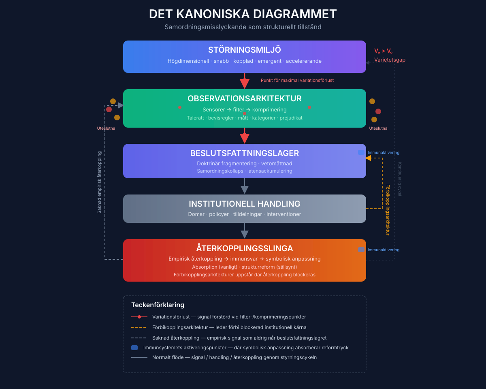

# Kapitel 3
## Varietetsgapet

Våren 2011 presenterade en seniorekonom vid Europeiska centralbanken ett paper vid ett stängt seminarium om utsikterna för euroområdet. Pappret var tekniskt fulländat, metodologiskt rigoröst och brett sett lugnande. Dess modeller visade att valutaunionen var fundamentalt stabil. Dess stresstester visade att banksystemet kunde stå emot en rad ogynnsamma scenarier. Dess analys av marknaderna för statsobligationer antydde att räntedifferenserna mellan tysk och perifer skuld återspeglade tillfälliga likviditetstryck snarare än fundamentala solvensbekymmer. Seminariedeltagarna – kontinentens bäst utbildade makroekonomer, verksamma vid en av världens mest sofistikerade policyinstitutioner – diskuterade pappret med den kollegiala stringens som den teknokratiska kulturen krävde. De ställde frågor om modellens kalibrering, om antagandena inbäddade i stresstesterna, om resultatens känslighet för parametervariation. De ställde inte frågan om hela ramverket observerade rätt dimensioner. Den frågan var, i en precis mening, omöjlig att ställa inifrån själva ramverket.

Inom arton månader skulle euroområdet befinna sig i greppet av en statsskuldskris som hotade valutaunionens överlevnad. De dimensioner längs vilka krisen utvecklades – återkopplingsslingan mellan bankers balansräkningar och staters lånekostnader, den politiska ekonomin kring anpassning inom medlemsstaterna, skörheten i gränsöverskridande interbanklånemarknader, otillräckligheten i de institutionella mekanismerna för finanspolitisk samordning mellan suveräna nationer – var dimensioner som ECB:s modeller systematiskt hade uteslutit. Modellerna var inte felaktiga i någon enkel mening. De var korrekta representationer av den ekonomi de hade utformats för att observera. De observerade helt enkelt för få dimensioner av den ekonomi som faktiskt existerade.

Detta är Varietetsgapet: den strukturella missanpassningen mellan dimensionaliteten hos den störningsmiljö som en institution måste styra och dimensionaliteten hos institutionens observationsarkitektur. Begreppet är tillräckligt precist för att förankra argumentationen i resten av denna bok, och tillräckligt allmänt för att tillämpas över varje domän som boken undersöker. Det är Rosettastenen som gör mönstret introducerat i kapitel 1 och den historiska dynamiken introducerad i kapitel 2 begripliga som ett enhetligt fenomen snarare än en samling intressanta men orelaterade fall. Och det är, ytterst, det diagnosverktyg som möjliggör designprinciperna i del IV.

---

### Vad variation betyder

Termen "variation" används i denna bok i den specifika bemärkelse som cybernetikern W. Ross Ashby gav den 1956. Ett systems variation är antalet distinkta tillstånd det kan inta – omfånget av tillgängliga konfigurationer. En termostat som kan registrera två tillstånd (för varmt, för kallt) har mindre variation än en som kan registrera ett kontinuerligt temperaturintervall. En medicinsk diagnos som kategoriserar patienter i "lindrig", "måttlig" och "svår" har mindre variation än en som fångar den specifika kombination av tillstånd, historia och omständigheter som karaktäriserar en enskild patient. Ett representationssystem som komprimerar den fulla fördelningen av medborgarpreferenser till ett val mellan två kandidater har mindre variation än ett som registrerar preferensintensitet över flera dimensioner.

Ashbys lag om nödvändig variation, ett av cybernetikens grundläggande resultat, fastställer att en regulator endast kan stabilisera ett system om regulatorns variation matchar eller överstiger variationen hos det system den försöker styra. Formellt: för att en regulator ska kunna hålla ett system inom en önskad uppsättning tillstånd måste regulatorn kunna registrera och svara på minst lika många distinkta tillstånd som de störningar vilka kan driva systemet utanför gränserna. Om regulatorns variation är otillräcklig framträder den oabsorberade variationen som okontrollerad varians i utfallen – kriser, kollapser och misslyckanden som regulatorn inte kan förutse och inte kan korrigera.

Detta är inte en riktlinje, en heuristik eller en designprincip. Det är ett teorem. Inget institutionellt arrangemang, hur välmenande, välfinansierat eller välbemannat det än är, kan stabilisera ett system vars variation överstiger dess egen. Matematiken gör inga undantag för demokratisk legitimitet, teknokratisk expertis eller historiska meriter.

Styrningsimplikationen är direkt och obekväm. Varje institution observerar den värld den styr genom en särskild uppsättning kanaler – mått, indikatorer, rapporteringskedjor, bevishierarkier. Dessa kanaler väljer ut en delmängd av världens dimensioner för institutionell uppmärksamhet och förpassar allt annat till brus. Institutionen kan endast svara på vad den kan uppfatta. De dimensioner den inte kan uppfatta upphör inte att verka. De ackumuleras som externaliteter – oprissatta, omätta, oredovisade – tills de tvingar sig till synlighet genom kris. Gapet mellan världens dimensionalitet och observationskanalens dimensionalitet är Varietetsgapet. Och när det överstiger ett kritiskt tröskelvärde blir institutionen konstitutionellt oförmögen att uppfatta de hot som så småningom kommer att destabilisera den.

Begreppet är abstrakt, men dess manifestationer är konkreta och ofta förödande. Centralbanken som övervakar inflation, produktion och sysselsättning genom ett enda ränteinstrument har en observationsarkitektur av mycket låg dimensionalitet – i praktiken två eller tre oberoende signaldimensioner. Ekonomin den styr har en dimensionalitet som är storleksordningar större. De uteslutna dimensionerna – tillgångsprisdynamik, privat skuldsättning, kreditallokeringskvalitet, fördelningseffekter, klimatexponering, gränsöverskridande kapitalflöden – ackumuleras som finansiell sårbarhet, politiskt missnöje och ekologisk risk tills de framtvingar en kris som det befintliga ramverket inte kan förutse. 2008 års kris var en passerad varietetsgap-tröskel. Den statsskuldskris som följde var en annan. Nästa – kanske involverande interaktionen mellan klimatrisk, statlig insolvens och avvecklingen av centralbankernas balansräkningar – ackumuleras nu, i dimensioner som den nuvarande observationsarkitekturen fortfarande utesluter.

Sjukhuset som övervakar patientgenomströmning, procedurvolymer och diagnoskoder genom en elektronisk patientjournal optimerad för fakturering har en observationsarkitektur av mycket låg dimensionalitet i förhållande till den enskilda patientens kliniska verklighet. De uteslutna dimensionerna – vårdsamordning, patientkontext, sociala bestämningsfaktorer, klinisk komplexitet – ackumuleras som undvikbar försämring, klinikerutbrändhet och den progressiva degraderingen av den kliniska signalen. Instrumentbrädan visar ett fungerande sjukhus. Patienten upplever ett system som inte kan se dem.

Universitetet som övervakar citeringsmått, tidskriftspubliceringar och institutionsrankningar har en observationsarkitektur av mycket låg dimensionalitet i förhållande till den kunskap det producerar. Den uteslutna dimensionen är integration: kapaciteten att sätta samman specialiserad kunskap över disciplingränser till sammanhängande förståelse av de flerdimensionella problem som världen faktiskt presenterar. Klimatforskaren och sociologen passerar varandra i korridoren, och besitter kollektivt all den kunskap som behövs för att förstå klimatförändringarna, utan någon institutionell väg att sätta samman vad de vet. Universitetets observationsarkitektur registrerar deras individuella produktivitet med stor precision. Den kan inte registrera den integration som inte äger rum.

AI-laboratoriet som övervakar kapacitetsriktmärken, driftsättningshastighet och konkurrenspositionering har en observationsarkitektur av mycket låg dimensionalitet i förhållande till de samhälleliga konsekvenserna av den teknik det utvecklar. De uteslutna dimensionerna – anpassningsrisk, arbetsmarknadsomvälvning, epistemisk infrastrukturdegradering, geopolitisk sårbarhet – ackumuleras som externaliteter som laboratoriets incitamentsstruktur aktivt avskräcker det från att uppfatta. Instrumentbrädan visar snabba framsteg. De uteslutna dimensionerna är någon annans problem, tills de är allas.

I varje fall är Varietetsgapet inte ett misslyckande i mätningen inom institutionens befintliga ramverk. Det är en egenskap hos själva ramverket – en konsekvens av valet av vilka dimensioner som ska observeras och vilka som ska ignoreras. Och i varje fall tenderar gapet att vidgas över tid, eftersom störningsmiljön genererar nya dimensioner snabbare än institutionens observationsarkitektur expanderar för att uppfatta dem.

---

### Läsbarhetskomprimeringsprincipen

Varje styrsystem måste reducera dimensionaliteten i sin miljö för att förbli beräkningsmässigt hanterbart. Ingen ändlig institution kan uppfatta allt. Världen är för komplex, informationsflödet för enormt, bearbetningskapaciteten hos varje beslutsfattande organ för begränsad. Komprimering är inte ett val; det är en strukturell nödvändighet.

Läsbarhetskomprimeringsprincipen fastställer att denna nödvändiga komprimering är irreversibelt förlustbringande, och att den information som förloras i komprimeringen ackumuleras som externaliteter tills den tvingar sig till synlighet genom kris. Principen har tre komponenter.

För det första, *komprimeringsnödvändighet*. All styrning kräver någon reduktion av miljömässig komplexitet. Frågan är inte om man ska komprimera utan hur mycket, längs vilka dimensioner och med vilka konsekvenser för den information som förkastas. En institution som vägrar att komprimera – som försöker uppfatta allt – blir paralyserad av volymen av sina egna observationer. En institution som komprimerar aggressivt blir blind för de dimensioner den utesluter. Varje styrningsarkitektur navigerar mellan dessa två felsätt.

För det andra, *irreversibilitet*. Information som förstörs i komprimering kan inte återskapas nedströms, oavsett sofistikeringen i den nedströms bearbetningen. När en nationell hälsoministerie observerar psykisk ohälsa genom en enda väntetidsindikator förstörs den rumsliga fördelningen av ohälsa – de specifika gemenskaper där ungdomsmottagningar har skurits ned, där otryggt boende driver ångest, där stängningen av ett allaktivitetshus har avlägsnat den sista informella stödstrukturen – i aggregeringen. Ingen analytisk sofistikering på ministerienivå kan återskapa denna rumsliga information, eftersom den aldrig överfördes. Ministeriet kan tillkännage 8 500 nya medarbetare inom psykisk ohälsa – ett verkligt svar på en verklig signal – och samtidigt kan de lokala myndigheterna i de mest drabbade områdena skära ned de förebyggande tjänster som skulle minska efterfrågan på dessa medarbetare, eftersom deras lokala fiskala trångmål är osynliga för den indikator som utlöste den nationella responsen.

För det tredje, *ackumulering*. De uteslutna dimensionerna upphör inte att verka. De fortsätter att generera effekter. Dessa effekter korsar in i institutionens observerbara rum, men i förvrängd form – som oförklarlig volatilitet, som "exogena chocker", som kriser som tycks komma från ingenstans. Institutionen svarar på effekterna men kan inte spåra dem till deras orsaker, eftersom orsakerna ligger i dimensioner som dess observationsarkitektur utesluter. Responsen är därför systematiskt felkalibrerad. Den adresserar symtom snarare än källor. Och eftersom institutionen mäter sin egen prestation mot de dimensioner den kan observera, kan den dra slutsatsen att dess respons var adekvat även när de uteslutna dimensionerna fortsätter att försämras, vilket banar väg för en större kris att komma.

Läsbarhetskomprimeringsprincipen är den mekanism som förbinder Varietetsgapet över alla de domäner som denna bok undersöker. BNP-komprimering i centralbanker förstör den information som skulle avslöja fördelningsstress, ekologisk nedbrytning och finansiell sårbarhet. Diagnoskodskomprimering i sjukhus förstör den information som skulle avslöja klinisk komplexitet, vårdsamordningsmisslyckande och sociala bestämningsfaktorer för hälsa. Citeringsmåttskomprimering i universitet förstör den information som skulle avslöja integrativ kapacitet, undervisningskvalitet och offentligt engagemang. Representationskedjekomprimering i demokratier förstör den information som skulle avslöja fördelningen av medborgarpreferenser, intensiteten i minoritetsangelägenheter och eroderingen av legitimitet i specifika gemenskaper. I varje fall är komprimeringen nödvändig. I varje fall är den förlustbringande. I varje fall ackumuleras förlusterna tills de framtvingar en räkenskap.

---

### Observerbarhetströskeln

Varietetsgapet är inte ett binärt tillstånd. En institution kan fungera med ett måttligt gap, absorbera den oobserverade variansen som oförklarat brus, förutsatt att signalen från de observerade dimensionerna förblir dominant. Institutionens beslut är degraderade, dess responser är felkalibrerade i marginalen, men dess grundläggande kapacitet att uppfatta och svara på de viktigaste dynamikerna förblir intakt. Gapet är en börda men ännu inte en kris.

Det existerar emellertid ett kritiskt tröskelvärde bortom vilket situationen förändras kvalitativt. Tröskeln är den punkt där signal-till-brusförhållandet i institutionens observationskanal faller under ett – den punkt där den information som de observerade dimensionerna bär om systemets verkliga tillstånd är mindre än den information som bidras av oövervakade störningar. Över tröskeln har institutionen en försämrad men informativ bild av den värld den styr. Under tröskeln styr institutionen en fantom: en representation av verkligheten vars dominerande drag är brusegenskaperna hos dess eget maskineri snarare än signalegenskaperna hos den värld den är tänkt att spåra.

Detta är observerbarhetströskeln, och dess implikationer är allvarliga. Ett styrsystem som opererar under tröskeln underpresterar inte bara. Det är konstitutionellt oförmöget till de funktioner det gör anspråk på att utföra. Centralbanken under tröskeln hanterar inte makroekonomin; den hanterar en statistisk artefakt vars relation till den faktiska ekonomin har blivit svag. Sjukhuset under tröskeln behandlar inte patienter; det behandlar de diagnoskoder som har ersatt patienter i dess observationskanal. Demokratin under tröskeln svarar inte på medborgarpreferenser; den svarar på brusstrukturen i sitt eget representationsmaskineri.

Under tröskeln blir förbättringar av institutionell kvalitet paradoxalt ineffektiva – eller aktivt kontraproduktiva. Bättre ekonomer som kör mer sofistikerade versioner av samma modeller producerar mer självsäkra feldiagnoser. Bättre kliniker som dokumenterar mer grundligt för samma faktureringskoder konsumerar mer av sin tid i tjänst hos en observationskanal som fortfarande inte kan se deras patienter. Bättre representanter som svarar mer troget på de preferenser som överlever representationskedjan förstärker snedvridningen snarare än korrigerar den. Institutionen är inte trasig på något sätt som bättre prestation inom dess befintliga arkitektur kan laga. Arkitekturen själv är problemet.

Observerbarhetströskeln ger precision åt intuitionen, vitt spridd men sällan formaliserad, att något har gått fundamentalt fel med den samtida världens styrningsinstitutioner. Det är inte så att de är mindre kompetenta än de brukade vara. Det är så att världen har vuxit sig mer komplex än deras observationsarkitekturer kan spåra, och de har passerat den tröskel bortom vilken kompetens inom det befintliga ramverket inte längre producerar effektiv styrning. Instrumentbrädan är grön. Systemet är oobserverbart. De två tillstånden är förenliga – mer än förenliga, de är strukturellt sammanlänkade, eftersom de mått som producerar den gröna instrumentbrädan är just de mått som utesluter de dimensioner längs vilka misslyckande utvecklas.

---

### Det kanoniska diagrammet

Varietetsgapet, Läsbarhetskomprimeringsprincipen och observerbarhetströskeln kan representeras i ett enda diagram som kommer att tjäna som referenspunkt för resten av denna bok. Diagrammet spårar informationsflödet från störningsmiljön genom institutionens observationsarkitektur, beslutsfattningslager och handling, och sedan genom den återkopplingsslinga som borde utlösa korrigering.

Överst finns störningsmiljön: högdimensionell, snabb, kopplad, emergent. Den innehåller alla de dimensioner som kan driva det styrda systemet bort från önskade tillstånd – de finansiella sårbarheterna, de kliniska komplexiteterna, kunskapsintegrationerna, medborgarpreferenserna, de ekologiska stressfaktorerna, de teknologiska disruptionerna. Den är alltid rikare än någon institution fullt ut kan uppfatta.

Under den finns observationsarkitekturen: sensorerna, filtren och komprimeringsmekanismerna som väljer ut en delmängd av störningsmiljöns dimensioner för institutionell uppmärksamhet. Det är här måtten väljs, indikatorerna definieras, rapporteringskedjorna struktureras, bevishierarkierna etableras. Detta är punkten för maximal variationsförlust. De röda pilarna i diagrammet markerar var information förstörs.

Den komprimerade signalen når beslutsfattningslagret, där den bearbetas genom institutionens deliberativa mekanismer – kommittéer, röstningsprocedurer, analytiska modeller, doktrinära ramverk. Beslutsfattningslagret producerar institutionell handling: domar, policyer, tilldelningar, interventioner. Denna handling återmatar till störningsmiljön och producerar nya tillstånd som borde observeras och ageras på.

Återkopplingsslingan bär empirisk information om utfallen av institutionell handling tillbaka mot observationsarkitekturen. Men det är här institutionens immunsystem – ämnet för kapitel 6 – aktiveras. Immunsystemet omvandlar empirisk återkoppling till symbolisk anpassning: skenet av reform utan substansen. Den återkoppling som borde utlösa korrigering absorberas, omtolkas eller undertrycks. Observationsarkitekturen förblir väsentligen oförändrad. Gapet består.

Grå streckade linjer markerar den saknade återkopplingen: den empiriska utvärderingen av systemisk påverkan som aldrig når beslutsfattningslagret eftersom observationskanalen inte kan överföra den. Gula streckade linjer markerar de förbikopplingsarkitekturer som uppstår när återkoppling är helt blockerad: genvägar som leder förbi den dysfunktionella kärnan, vilka demonstrerar alternativ samtidigt som de minskar trycket för reform.

Diagrammet är inte en representation av någon enskild institution. Det är ett sammansatt porträtt, hämtat från de mönster som återkommer över de fall som undersöks i denna bok. De specifika sensorerna, filtren och immunmekanismerna skiljer sig åt mellan domäner. Det underliggande flödet är invariant. Diagrammet är den visuella komprimeringen av bokens argumentation – den kanoniska kartan över hur kompetenta institutioner blir blinda för sin egen sårbarhet, och varför denna blindhet består även när konsekvenserna är synliga för alla utanför institutionens egna observationskanaler.

---

Detta kapitel har introducerat Varietetsgapet som den konceptuella kärnan i bokens diagnostiska ramverk. Gapet är den strukturella missanpassningen mellan vad en institution kan uppfatta och vad som bestämmer utfallen av dess handlingar. Det produceras av Läsbarhetskomprimeringsprincipen – den nödvändiga men förlustbringande reduktionen av miljömässig komplexitet som varje institution måste utföra. Det blir kritiskt när signal-till-brusförhållandet i institutionens observationskanal faller under observerbarhetströskeln, vid vilken punkt institutionen styr en fantom snarare än en verklighet.

Begreppet är abstrakt, men dess implikationer är konkreta. De kapitel som följer kommer att visa hur gapet produceras och upprätthålls av specifika mekanismer – observationskanalens degradering, immunförsvarsaktivering, Upplösningslåsning och den ackumulerande dynamik som gör att samtidiga misslyckanden multipliceras snarare än adderas. De kommer att demonstrera gapets återkomst över de domäner som formar det samtida livet. Och de kommer att utforska vad en arkitektur som slöt gapet skulle kräva.

Men innan blindhetens maskineri dissekeras måste en fråga adresseras – en fråga som naturligt kommer att uppstå i sinnet hos varje läsare som har följt argumentationen så här långt. Om Varietetsgapet är strukturellt, och om ett passerande av observerbarhetströskeln gör effektiv styrning omöjlig, varför ser människorna inuti dessa institutioner det inte? De är intelligenta. De är hängivna. De har tillgång till information som utomstående inte har. Varför består gapet?

Svaret är inte individuellt misslyckande. Det är arkitektoniskt. Och det är ämnet för nästa kapitel.
